# dysapp 시스템 플로우차트 및 구조 문서

**작성일**: 2025-01-XX  
**프로젝트**: dysapp1210  
**버전**: 1.0.0

---

## 목차

1. [전체 시스템 플로우차트](#1-전체-시스템-플로우차트)
2. [탭별 플로우차트](#2-탭별-플로우차트)
3. [세부 기능 플로우차트](#3-세부-기능-플로우차트)
4. [전체 정보구조](#4-전체-정보구조)
5. [전체 사이트맵](#5-전체-사이트맵)
6. [태스크 플로우](#6-태스크-플로우)
7. [백엔드 기능 프레임워크](#7-백엔드-기능-프레임워크)

---

## 1. 전체 시스템 플로우차트

### 1.1 사용자 진입부터 분석 완료까지 전체 흐름

```mermaid
flowchart TD
    Start([사용자 앱 진입]):::startEnd
    InitApp[앱 초기화]:::process
    
    classDef startEnd fill:#90EE90,stroke:#006400,stroke-width:3px,color:#000
    classDef process fill:#87CEEB,stroke:#4682B4,stroke-width:2px,color:#000
    classDef decision fill:#FFD700,stroke:#FF8C00,stroke-width:2px,color:#000
    classDef error fill:#FF6B6B,stroke:#DC143C,stroke-width:2px,color:#fff
    
    Start --> InitApp
    
    subgraph AuthFlow ["인증 프로세스"]
        direction TB
        CheckAuth{"인증 상태 확인"}:::decision
        AuthSuccess[인증 완료]:::process
        SignInAnon[익명 인증 시도]:::process
        SignInResult{"인증 성공?"}:::decision
        AuthError[인증 오류]:::error
        ShowAuthError[오류 메시지 표시]:::error
        
        InitApp --> CheckAuth
        CheckAuth -->|인증됨| AuthSuccess
        CheckAuth -->|미인증| SignInAnon
        SignInAnon --> SignInResult
        SignInResult -->|Yes| AuthSuccess
        SignInResult -->|No| AuthError
        AuthError --> ShowAuthError
    end
    
    PageSelect{"페이지 선택"}:::decision
    
    AuthSuccess --> PageSelect
    
    subgraph UploadFlow ["업로드 페이지"]
        direction TB
        UploadFile[파일 선택]:::process
        ValidateFile{"파일 검증"}:::decision
        ShowPreview[미리보기 표시]:::process
        FileError[파일 오류]:::error
        OptionalPrompt{"프롬프트 입력?"}:::decision
        WithPrompt[프롬프트 포함]:::process
        NoPrompt[프롬프트 없음]:::process
        SendAnalysis[분석 요청 전송]:::process
        LoadingAnalysis[로딩 표시]:::process
        CallAPI[analyzeDesign API 호출]:::process
        
        PageSelect -->|업로드| UploadFile
        UploadFile --> ValidateFile
        ValidateFile -->|유효| ShowPreview
        ValidateFile -->|무효| FileError
        FileError -.->|재시도| UploadFile
        ShowPreview --> OptionalPrompt
        OptionalPrompt -->|있음| WithPrompt
        OptionalPrompt -->|없음| NoPrompt
        WithPrompt --> SendAnalysis
        NoPrompt --> SendAnalysis
        SendAnalysis --> LoadingAnalysis
        LoadingAnalysis --> CallAPI
    end
    
    subgraph BackendAnalysis ["백엔드 분석"]
        direction TB
        BackendAuth{"인증 확인"}:::decision
        RateCheck{"Rate Limit 체크"}:::decision
        BackendAuthError[인증 오류]:::error
        ValidateBackend[입력 검증]:::process
        RateError[Rate Limit 오류]:::error
        UploadStorage[Storage 업로드]:::process
        ValidationError[검증 오류]:::error
        VisionAPI[Gemini Vision API]:::process
        VisionResult{"Vision 결과"}:::decision
        ValidateLLM{"LLM 응답 검증"}:::decision
        VisionError[Vision API 오류]:::error
        GenerateEmbed[Embedding 생성]:::process
        LLMError[LLM 응답 오류]:::error
        SaveDB[Firestore 저장]:::process
        SaveResult{"저장 성공?"}:::decision
        ReturnSuccess[성공 응답]:::process
        DBError[Firestore 오류]:::error
        
        CallAPI --> BackendAuth
        BackendAuth -->|인증됨| RateCheck
        BackendAuth -->|미인증| BackendAuthError
        RateCheck -->|통과| ValidateBackend
        RateCheck -->|초과| RateError
        ValidateBackend -->|유효| UploadStorage
        ValidateBackend -->|무효| ValidationError
        UploadStorage --> VisionAPI
        VisionAPI --> VisionResult
        VisionResult -->|성공| ValidateLLM
        VisionResult -->|실패| VisionError
        ValidateLLM -->|유효| GenerateEmbed
        ValidateLLM -->|무효| LLMError
        GenerateEmbed --> SaveDB
        SaveDB --> SaveResult
        SaveResult -->|성공| ReturnSuccess
        SaveResult -->|실패| DBError
    end
    
    StoreAnalysisId[analysisId 저장]:::process
    NavigateAnalyze[analyze 페이지로 이동]:::process
    
    ReturnSuccess --> StoreAnalysisId
    StoreAnalysisId --> NavigateAnalyze
    
    APIError[API 오류 처리]:::error
    RetryDecision{"재시도?"}:::decision
    ShowError[에러 메시지 표시]:::error
    
    BackendAuthError --> APIError
    RateError --> APIError
    ValidationError --> APIError
    VisionError --> APIError
    LLMError --> APIError
    DBError --> APIError
    
    APIError --> RetryDecision
    RetryDecision -->|Yes| SendAnalysis
    RetryDecision -->|No| ShowError
    
    subgraph AnalyzeFlow ["분석 페이지"]
        direction TB
        LoadAnalysis[분석 데이터 로드]:::process
        LoadResult{"로드 성공?"}:::decision
        RenderResults[결과 렌더링]:::process
        LoadError[로드 오류]:::error
        ShowAnalysis[분석 결과 표시]:::process
        ChatAvailable[AI 챗 가능]:::process
        
        NavigateAnalyze --> LoadAnalysis
        LoadAnalysis --> LoadResult
        LoadResult -->|성공| RenderResults
        LoadResult -->|실패| LoadError
        LoadError -.->|재시도| LoadAnalysis
        RenderResults --> ShowAnalysis
        ShowAnalysis --> ChatAvailable
    end
    
    EndError([오류 종료]):::startEnd
    EndSuccess([성공 종료]):::startEnd
    
    ShowError --> EndError
    ChatAvailable --> EndSuccess
```

---

## 2. 탭별 플로우차트

### 2.1 업로드 탭 (index.html)

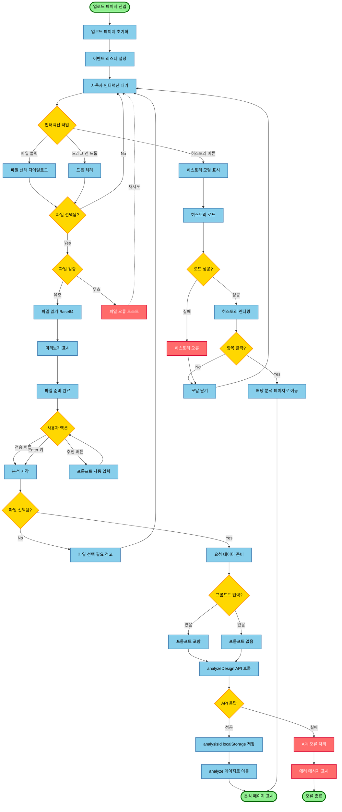
```mermaid
flowchart TD
    Start([업로드 페이지 진입]):::startEnd
    InitUpload[업로드 페이지 초기화]:::process
    
    classDef startEnd fill:#90EE90,stroke:#006400,stroke-width:3px,color:#000
    classDef process fill:#87CEEB,stroke:#4682B4,stroke-width:2px,color:#000
    classDef decision fill:#FFD700,stroke:#FF8C00,stroke-width:2px,color:#000
    classDef error fill:#FF6B6B,stroke:#DC143C,stroke-width:2px,color:#fff
    
    Start --> InitUpload
    
    SetupEvents[이벤트 리스너 설정]:::process
    WaitInteraction[사용자 인터랙션 대기]:::process
    InteractionType{"인터랙션 타입"}:::decision
    
    InitUpload --> SetupEvents
    SetupEvents --> WaitInteraction
    WaitInteraction --> InteractionType
    
    OpenFileDialog[파일 선택 다이얼로그]:::process
    HandleDrop[드롭 처리]:::process
    ShowHistory[히스토리 모달 표시]:::process
    FileSelected{"파일 선택됨?"}:::decision
    
    InteractionType -->|파일 클릭| OpenFileDialog
    InteractionType -->|드래그 앤 드롭| HandleDrop
    InteractionType -->|히스토리 버튼| ShowHistory
    
    OpenFileDialog --> FileSelected
    HandleDrop --> FileSelected
    
    ValidateFile{"파일 검증"}:::decision
    ReadFile[파일 읽기 Base64]:::process
    FileError[파일 오류 토스트]:::error
    ShowPreview[미리보기 표시]:::process
    FileReady[파일 준비 완료]:::process
    UserAction{"사용자 액션"}:::decision
    
    FileSelected -->|Yes| ValidateFile
    FileSelected -->|No| WaitInteraction
    
    ValidateFile -->|유효| ReadFile
    ValidateFile -->|무효| FileError
    FileError -.->|재시도| WaitInteraction
    
    ReadFile --> ShowPreview
    ShowPreview --> FileReady
    FileReady --> UserAction
    
    StartAnalysis[분석 시작]:::process
    FillPrompt[프롬프트 자동 입력]:::process
    CheckFile{"파일 선택됨?"}:::decision
    WarnNoFile[파일 선택 필요 경고]:::process
    PrepareRequest[요청 데이터 준비]:::process
    GetPrompt{"프롬프트 입력?"}:::decision
    WithPrompt[프롬프트 포함]:::process
    NoPrompt[프롬프트 없음]:::process
    CallAPI[analyzeDesign API 호출]:::process
    APIResult{"API 응답"}:::decision
    
    UserAction -->|전송 버튼| StartAnalysis
    UserAction -->|Enter 키| StartAnalysis
    UserAction -->|추천 버튼| FillPrompt
    FillPrompt --> UserAction
    
    StartAnalysis --> CheckFile
    CheckFile -->|No| WarnNoFile
    WarnNoFile --> WaitInteraction
    CheckFile -->|Yes| PrepareRequest
    
    PrepareRequest --> GetPrompt
    GetPrompt -->|있음| WithPrompt
    GetPrompt -->|없음| NoPrompt
    WithPrompt --> CallAPI
    NoPrompt --> CallAPI
    
    CallAPI --> APIResult
    
    StoreID[analysisId localStorage 저장]:::process
    Navigate[analyze 페이지로 이동]:::process
    End([분석 페이지 표시]):::startEnd
    APIError[API 오류 처리]:::error
    ShowAPIError[에러 메시지 표시]:::error
    EndError([오류 종료]):::startEnd
    
    APIResult -->|성공| StoreID
    APIResult -->|실패| APIError
    
    StoreID --> Navigate
    Navigate --> End
    
    APIError --> ShowAPIError
    ShowAPIError --> EndError
    
    LoadHistory[히스토리 로드]:::process
    HistoryResult{"로드 성공?"}:::decision
    RenderHistory[히스토리 렌더링]:::process
    HistoryError[히스토리 오류]:::error
    HistoryClick{"항목 클릭?"}:::decision
    NavigateToItem[해당 분석 페이지로 이동]:::process
    CloseModal[모달 닫기]:::process
    
    ShowHistory --> LoadHistory
    LoadHistory --> HistoryResult
    HistoryResult -->|성공| RenderHistory
    HistoryResult -->|실패| HistoryError
    
    RenderHistory --> HistoryClick
    HistoryClick -->|Yes| NavigateToItem
    HistoryClick -->|No| CloseModal
    
    NavigateToItem --> End
    CloseModal --> WaitInteraction
    HistoryError --> CloseModal
```

### 2.2 분석 탭 (analyze.html)

```mermaid
flowchart TD
    Start([분석 페이지 진입]):::startEnd
    GetID{"분석 ID 확인"}:::decision
    
    classDef startEnd fill:#90EE90,stroke:#006400,stroke-width:3px,color:#000
    classDef process fill:#87CEEB,stroke:#4682B4,stroke-width:2px,color:#000
    classDef decision fill:#FFD700,stroke:#FF8C00,stroke-width:2px,color:#000
    classDef error fill:#FF6B6B,stroke:#DC143C,stroke-width:2px,color:#fff
    
    Start --> GetID
    
    UseURLID[URL에서 ID 추출]:::process
    UseStorageID[localStorage에서 ID 추출]:::process
    NoIDError[ID 없음 오류]:::error
    LoadAnalysis[분석 데이터 로드]:::process
    
    GetID -->|URL 파라미터| UseURLID
    GetID -->|localStorage| UseStorageID
    GetID -->|없음| NoIDError
    
    UseURLID --> LoadAnalysis
    UseStorageID --> LoadAnalysis
    
    ShowErrorMsg[오류 메시지 표시]:::error
    RedirectUpload[업로드 페이지로 리다이렉트]:::error
    EndError([오류 종료]):::startEnd
    
    NoIDError --> ShowErrorMsg
    ShowErrorMsg --> RedirectUpload
    RedirectUpload --> EndError
    
    ShowSkeleton[스켈레톤 UI 표시]:::process
    CallGetAnalysis[getAnalysis API 호출]:::process
    APIResponse{"API 응답"}:::decision
    
    LoadAnalysis --> ShowSkeleton
    ShowSkeleton --> CallGetAnalysis
    CallGetAnalysis --> APIResponse
    
    AdaptData[데이터 어댑터 적용]:::process
    APIError[API 오류]:::error
    ErrorType{"오류 타입"}:::decision
    
    APIResponse -->|성공| AdaptData
    APIResponse -->|실패| APIError
    
    APIError --> ErrorType
    
    NetworkError[네트워크 오류 UI]:::error
    NotFoundError[찾을 수 없음 UI]:::error
    TimeoutError[타임아웃 UI]:::error
    ServerError[서버 오류 UI]:::error
    RetryButton{"재시도 버튼?"}:::decision
    
    ErrorType -->|네트워크| NetworkError
    ErrorType -->|404| NotFoundError
    ErrorType -->|타임아웃| TimeoutError
    ErrorType -->|서버| ServerError
    
    NetworkError --> RetryButton
    NotFoundError --> RetryButton
    TimeoutError --> RetryButton
    ServerError --> RetryButton
    
    RetryButton -->|Yes| LoadAnalysis
    RetryButton -->|No| EndError
    
    HideSkeleton[스켈레톤 숨김]:::process
    RenderAll[전체 결과 렌더링]:::process
    RenderHeader[헤더 렌더링]:::process
    RenderKeywords[키워드 렌더링]:::process
    RenderOverall[종합 분석 렌더링]:::process
    RenderBoxes[데이터 박스 렌더링]:::process
    RenderAISuggestion[AI 제안 렌더링]:::process
    RenderChatSuggestions[챗 제안 렌더링]:::process
    SetupModals[모달 이벤트 설정]:::process
    SetupChat[챗 이벤트 설정]:::process
    PageReady[페이지 준비 완료]:::process
    
    AdaptData --> HideSkeleton
    HideSkeleton --> RenderAll
    RenderAll --> RenderHeader
    RenderHeader --> RenderKeywords
    RenderKeywords --> RenderOverall
    RenderOverall --> RenderBoxes
    RenderBoxes --> RenderAISuggestion
    RenderAISuggestion --> RenderChatSuggestions
    RenderChatSuggestions --> SetupModals
    SetupModals --> SetupChat
    SetupChat --> PageReady
    
    UserInteraction{"사용자 인터랙션"}:::decision
    
    PageReady --> UserInteraction
    
    OpenDetailModal[상세 모달 열기]:::process
    ShowModalContent[모달 내용 표시]:::process
    ModalClose{"모달 닫기?"}:::decision
    CloseModal[모달 닫기]:::process
    
    UserInteraction -->|데이터 박스 클릭| OpenDetailModal
    OpenDetailModal --> ShowModalContent
    ShowModalContent --> ModalClose
    ModalClose -->|Yes| CloseModal
    ModalClose -->|No| ShowModalContent
    CloseModal --> UserInteraction
    
    SendChat[챗 메시지 전송]:::process
    FillChatInput[챗 입력란 채우기]:::process
    ValidateMessage{"메시지 유효?"}:::decision
    WarnEmpty[빈 메시지 경고]:::process
    AddUserMsg[사용자 메시지 추가]:::process
    ShowTyping[타이핑 인디케이터 표시]:::process
    CallChatAPI[chatWithMentor API 호출]:::process
    ChatResponse{"챗 응답"}:::decision
    
    UserInteraction -->|챗 메시지 입력| SendChat
    UserInteraction -->|제안 클릭| FillChatInput
    FillChatInput --> UserInteraction
    
    SendChat --> ValidateMessage
    ValidateMessage -->|No| WarnEmpty
    WarnEmpty --> UserInteraction
    ValidateMessage -->|Yes| AddUserMsg
    
    AddUserMsg --> ShowTyping
    ShowTyping --> CallChatAPI
    CallChatAPI --> ChatResponse
    
    StoreSession[세션 ID 저장]:::process
    ChatError[챗 오류]:::error
    HideTyping[타이핑 인디케이터 숨김]:::process
    AddAIMsg[AI 메시지 추가]:::process
    ScrollChat[챗 스크롤]:::process
    ShowChatError[챗 오류 메시지]:::error
    
    ChatResponse -->|성공| StoreSession
    ChatResponse -->|실패| ChatError
    
    StoreSession --> HideTyping
    HideTyping --> AddAIMsg
    AddAIMsg --> ScrollChat
    ScrollChat --> UserInteraction
    
    ChatError --> ShowChatError
    ShowChatError --> UserInteraction
```

### 2.3 검색 탭 (searchTab.html)

```mermaid
flowchart TD
    Start([검색 페이지 진입]):::startEnd
    InitSearch[검색 페이지 초기화]:::process
    
    classDef startEnd fill:#90EE90,stroke:#006400,stroke-width:3px,color:#000
    classDef process fill:#87CEEB,stroke:#4682B4,stroke-width:2px,color:#000
    classDef decision fill:#FFD700,stroke:#FF8C00,stroke-width:2px,color:#000
    classDef error fill:#FF6B6B,stroke:#DC143C,stroke-width:2px,color:#fff
    
    Start --> InitSearch
    
    SetupSearchEvents[검색 이벤트 설정]:::process
    AutoSearch{"자동 검색 실행?"}:::decision
    WaitUserInput[사용자 입력 대기]:::process
    
    InitSearch --> SetupSearchEvents
    SetupSearchEvents --> AutoSearch
    
    CheckLastAnalysis{"마지막 분석 존재?"}:::decision
    LoadLastAnalysis[마지막 분석 데이터 로드]:::process
    GenerateQuery[검색 쿼리 생성]:::process
    QuerySource{"쿼리 소스"}:::decision
    
    AutoSearch -->|Yes| CheckLastAnalysis
    AutoSearch -->|No| WaitUserInput
    
    CheckLastAnalysis -->|있음| LoadLastAnalysis
    CheckLastAnalysis -->|없음| WaitUserInput
    
    LoadLastAnalysis --> GenerateQuery
    GenerateQuery --> QuerySource
    
    UseRAG[RAG 쿼리 사용]:::process
    UseKeywords[키워드 사용]:::process
    UseFormat[포맷 사용]:::process
    CustomSearch[Custom Search 실행]:::process
    
    QuerySource -->|ragSearchQueries| UseRAG
    QuerySource -->|detectedKeywords| UseKeywords
    QuerySource -->|formatPrediction| UseFormat
    QuerySource -->|없음| WaitUserInput
    
    UseRAG --> CustomSearch
    UseKeywords --> CustomSearch
    UseFormat --> CustomSearch
    
    InputType{"입력 타입"}:::decision
    
    WaitUserInput --> InputType
    
    TextInput[텍스트 입력]:::process
    ImageUpload[이미지 업로드]:::process
    QuickSearch[빠른 검색]:::process
    OpenFilter[필터 페이지 열기]:::process
    
    InputType -->|텍스트 입력| TextInput
    InputType -->|이미지 업로드| ImageUpload
    InputType -->|검색 버튼| QuickSearch
    InputType -->|필터 버튼| OpenFilter
    
    ValidateText{"텍스트 유효?"}:::decision
    PerformTextSearch[텍스트 검색 실행]:::process
    WarnShort[2자 이상 필요 경고]:::process
    CallSearchText[searchText API 호출]:::process
    
    TextInput --> ValidateText
    ValidateText -->|2자 이상| PerformTextSearch
    ValidateText -->|2자 미만| WarnShort
    WarnShort --> WaitUserInput
    
    PerformTextSearch --> CallSearchText
    
    ValidateImage{"이미지 유효?"}:::decision
    AnalyzeImage[이미지 분석]:::process
    ImageError[이미지 오류]:::error
    AnalyzeResult{"분석 성공?"}:::decision
    SimilarSearch[유사 디자인 검색]:::process
    AnalyzeError[분석 오류]:::error
    CallSearchSimilar[searchSimilar API 호출]:::process
    
    ImageUpload --> ValidateImage
    ValidateImage -->|유효| AnalyzeImage
    ValidateImage -->|무효| ImageError
    ImageError --> WaitUserInput
    
    AnalyzeImage --> AnalyzeResult
    AnalyzeResult -->|성공| SimilarSearch
    AnalyzeResult -->|실패| AnalyzeError
    AnalyzeError --> WaitUserInput
    
    SimilarSearch --> CallSearchSimilar
    
    CheckLastID{"마지막 분석 ID?"}:::decision
    InfoNoAnalysis[분석 필요 안내]:::process
    
    QuickSearch --> CheckLastID
    CheckLastID -->|있음| CallSearchSimilar
    CheckLastID -->|없음| InfoNoAnalysis
    InfoNoAnalysis --> WaitUserInput
    
    CustomResult{"검색 결과"}:::decision
    TextResult{"검색 결과"}:::decision
    SimilarResult{"검색 결과"}:::decision
    
    CustomSearch --> CustomResult
    CallSearchText --> TextResult
    CallSearchSimilar --> SimilarResult
    
    AdaptCustom[Custom 결과 어댑터]:::process
    AdaptText[텍스트 결과 어댑터]:::process
    AdaptSimilar[유사 결과 어댑터]:::process
    SearchError[검색 오류]:::error
    
    CustomResult -->|성공| AdaptCustom
    CustomResult -->|실패| SearchError
    TextResult -->|성공| AdaptText
    TextResult -->|실패| SearchError
    SimilarResult -->|성공| AdaptSimilar
    SimilarResult -->|실패| SearchError
    
    RenderCustom[Custom 결과 렌더링]:::process
    RenderSimilar[유사 결과 렌더링]:::process
    SetupInfinite[무한 스크롤 설정]:::process
    SetupClick[클릭 이벤트 설정]:::process
    
    AdaptCustom --> RenderCustom
    AdaptText --> RenderSimilar
    AdaptSimilar --> RenderSimilar
    
    RenderCustom --> SetupInfinite
    RenderSimilar --> SetupClick
    
    CheckMore{"더 보기 가능?"}:::decision
    LoadMore[추가 결과 로드]:::process
    ResultsDisplayed[결과 표시 완료]:::process
    
    SetupInfinite --> CheckMore
    CheckMore -->|Yes| LoadMore
    CheckMore -->|No| ResultsDisplayed
    LoadMore --> CustomSearch
    
    ResultInteraction{"결과 상호작용"}:::decision
    
    SetupClick --> ResultInteraction
    
    OpenResultModal[결과 모달 열기]:::process
    HandleShare[공유 처리]:::process
    HandleDownload[다운로드 처리]:::process
    ShowModal[모달 내용 표시]:::process
    ModalAction{"모달 액션"}:::decision
    
    ResultInteraction -->|카드 클릭| OpenResultModal
    ResultInteraction -->|공유 버튼| HandleShare
    ResultInteraction -->|다운로드 버튼| HandleDownload
    
    OpenResultModal --> ShowModal
    ShowModal --> ModalAction
    
    SaveItem[saveItem API 호출]:::process
    CloseResultModal[모달 닫기]:::process
    CopyLink[링크 클립보드 복사]:::process
    ShareSuccess[공유 성공 토스트]:::process
    FetchImage[이미지 다운로드]:::process
    DownloadSuccess[다운로드 성공]:::process
    SaveResult{"저장 결과"}:::decision
    SaveSuccess[저장 성공 토스트]:::process
    SaveError[저장 오류]:::error
    
    ModalAction -->|저장| SaveItem
    ModalAction -->|공유| HandleShare
    ModalAction -->|다운로드| HandleDownload
    ModalAction -->|닫기| CloseResultModal
    
    HandleShare --> CopyLink
    CopyLink --> ShareSuccess
    
    HandleDownload --> FetchImage
    FetchImage --> DownloadSuccess
    
    SaveItem --> SaveResult
    SaveResult -->|성공| SaveSuccess
    SaveResult -->|실패| SaveError
    
    CloseResultModal --> ResultsDisplayed
    ShareSuccess --> ResultsDisplayed
    DownloadSuccess --> ResultsDisplayed
    SaveSuccess --> ResultsDisplayed
    SaveError --> ResultsDisplayed
    
    ShowSearchError[검색 오류 메시지]:::error
    End([검색 완료]):::startEnd
    
    SearchError --> ShowSearchError
    ShowSearchError --> WaitUserInput
    
    ResultsDisplayed --> End
    
    NavigateFilter[filter 페이지로 이동]:::process
    ApplyFilters[필터 적용]:::process
    ReturnSearch[검색 페이지로 복귀]:::process
    ReapplySearch[필터 적용 검색 재실행]:::process
    
    OpenFilter --> NavigateFilter
    NavigateFilter --> ApplyFilters
    ApplyFilters --> ReturnSearch
    ReturnSearch --> ReapplySearch
    ReapplySearch --> CallSearchText
```

### 2.4 마이페이지 (mypage.html)

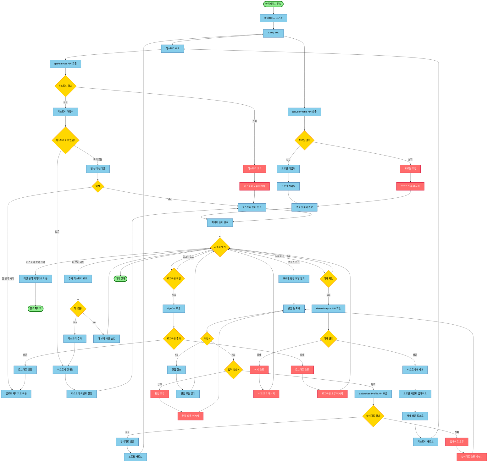
```mermaid
flowchart TD
    Start([마이페이지 진입]):::startEnd
    InitMypage[마이페이지 초기화]:::process
    
    classDef startEnd fill:#90EE90,stroke:#006400,stroke-width:3px,color:#000
    classDef process fill:#87CEEB,stroke:#4682B4,stroke-width:2px,color:#000
    classDef decision fill:#FFD700,stroke:#FF8C00,stroke-width:2px,color:#000
    classDef error fill:#FF6B6B,stroke:#DC143C,stroke-width:2px,color:#fff
    
    Start --> InitMypage
    
    LoadProfile[프로필 로드]:::process
    LoadHistory[히스토리 로드]:::process
    
    InitMypage --> LoadProfile
    LoadProfile --> LoadHistory
    
    CallProfileAPI[getUserProfile API 호출]:::process
    ProfileResult{"프로필 결과"}:::decision
    AdaptProfile[프로필 어댑터]:::process
    ProfileError[프로필 오류]:::error
    RenderProfile[프로필 렌더링]:::process
    ProfileReady[프로필 준비 완료]:::process
    ShowProfileError[프로필 오류 메시지]:::error
    
    LoadProfile --> CallProfileAPI
    CallProfileAPI --> ProfileResult
    ProfileResult -->|성공| AdaptProfile
    ProfileResult -->|실패| ProfileError
    AdaptProfile --> RenderProfile
    RenderProfile --> ProfileReady
    ProfileError --> ShowProfileError
    ShowProfileError --> ProfileReady
    
    CallHistoryAPI[getAnalyses API 호출]:::process
    HistoryResult{"히스토리 결과"}:::decision
    AdaptHistory[히스토리 어댑터]:::process
    HistoryError[히스토리 오류]:::error
    CheckEmpty{"히스토리 비어있음?"}:::decision
    RenderEmpty[빈 상태 렌더링]:::process
    RenderHistory[히스토리 렌더링]:::process
    EmptyAction{"액션"}:::decision
    NavigateUpload[업로드 페이지로 이동]:::process
    HistoryReady[히스토리 준비 완료]:::process
    SetupHistoryEvents[히스토리 이벤트 설정]:::process
    ShowHistoryError[히스토리 오류 메시지]:::error
    
    LoadHistory --> CallHistoryAPI
    CallHistoryAPI --> HistoryResult
    HistoryResult -->|성공| AdaptHistory
    HistoryResult -->|실패| HistoryError
    AdaptHistory --> CheckEmpty
    CheckEmpty -->|비어있음| RenderEmpty
    CheckEmpty -->|있음| RenderHistory
    RenderEmpty --> EmptyAction
    EmptyAction -->|첫 분석 시작| NavigateUpload
    EmptyAction -->|대기| HistoryReady
    RenderHistory --> SetupHistoryEvents
    SetupHistoryEvents --> HistoryReady
    HistoryError --> ShowHistoryError
    ShowHistoryError --> HistoryReady
    
    PageReady[페이지 준비 완료]:::process
    UserAction{"사용자 액션"}:::decision
    
    ProfileReady --> PageReady
    HistoryReady --> PageReady
    PageReady --> UserAction
    
    OpenProfileEditor[프로필 편집 모달 열기]:::process
    EditForm[편집 폼 표시]:::process
    SubmitEdit{"저장?"}:::decision
    ValidateEdit{"입력 유효?"}:::decision
    CancelEdit[편집 취소]:::process
    CallUpdateProfile[updateUserProfile API 호출]:::process
    EditError[편집 오류]:::error
    UpdateResult{"업데이트 결과"}:::decision
    UpdateSuccess[업데이트 성공]:::process
    UpdateError[업데이트 오류]:::error
    ReloadProfile[프로필 재로드]:::process
    ShowUpdateError[업데이트 오류 메시지]:::error
    ShowEditError[편집 오류 메시지]:::error
    CloseEditor[편집 모달 닫기]:::process
    
    UserAction -->|프로필 편집| OpenProfileEditor
    OpenProfileEditor --> EditForm
    EditForm --> SubmitEdit
    SubmitEdit -->|Yes| ValidateEdit
    SubmitEdit -->|No| CancelEdit
    ValidateEdit -->|유효| CallUpdateProfile
    ValidateEdit -->|무효| EditError
    CallUpdateProfile --> UpdateResult
    UpdateResult -->|성공| UpdateSuccess
    UpdateResult -->|실패| UpdateError
    UpdateSuccess --> ReloadProfile
    ReloadProfile --> LoadProfile
    UpdateError --> ShowUpdateError
    ShowUpdateError --> EditForm
    EditError --> ShowEditError
    ShowEditError --> EditForm
    CancelEdit --> CloseEditor
    CloseEditor --> UserAction
    
    NavigateToAnalysis[해당 분석 페이지로 이동]:::process
    EndNavigate([분석 페이지]):::startEnd
    ConfirmDelete{"삭제 확인"}:::decision
    CallDelete[deleteAnalysis API 호출]:::process
    DeleteResult{"삭제 결과"}:::decision
    RemoveFromList[리스트에서 제거]:::process
    DeleteError[삭제 오류]:::error
    UpdateCount[프로필 카운트 업데이트]:::process
    DeleteSuccess[삭제 성공 토스트]:::process
    ReloadHistory[히스토리 재로드]:::process
    ShowDeleteError[삭제 오류 메시지]:::error
    
    UserAction -->|히스토리 항목 클릭| NavigateToAnalysis
    NavigateToAnalysis --> EndNavigate
    
    UserAction -->|삭제 버튼| ConfirmDelete
    ConfirmDelete -->|Yes| CallDelete
    ConfirmDelete -->|No| UserAction
    CallDelete --> DeleteResult
    DeleteResult -->|성공| RemoveFromList
    DeleteResult -->|실패| DeleteError
    RemoveFromList --> UpdateCount
    UpdateCount --> DeleteSuccess
    DeleteSuccess --> ReloadHistory
    ReloadHistory --> LoadHistory
    DeleteError --> ShowDeleteError
    ShowDeleteError --> UserAction
    
    LoadMoreHistory[추가 히스토리 로드]:::process
    CheckHasMore{"더 있음?"}:::decision
    AppendHistory[히스토리 추가]:::process
    HideLoadMore[더 보기 버튼 숨김]:::process
    
    UserAction -->|더 보기 버튼| LoadMoreHistory
    LoadMoreHistory --> CheckHasMore
    CheckHasMore -->|Yes| AppendHistory
    CheckHasMore -->|No| HideLoadMore
    AppendHistory --> RenderHistory
    HideLoadMore --> UserAction
    
    ConfirmLogout{"로그아웃 확인"}:::decision
    CallSignout[signOut 호출]:::process
    LogoutResult{"로그아웃 결과"}:::decision
    LogoutSuccess[로그아웃 성공]:::process
    LogoutError[로그아웃 오류]:::error
    ShowLogoutError[로그아웃 오류 메시지]:::error
    End([대기 상태]):::startEnd
    
    UserAction -->|로그아웃| ConfirmLogout
    ConfirmLogout -->|Yes| CallSignout
    ConfirmLogout -->|No| UserAction
    CallSignout --> LogoutResult
    LogoutResult -->|성공| LogoutSuccess
    LogoutResult -->|실패| LogoutError
    LogoutSuccess --> NavigateUpload
    LogoutError --> ShowLogoutError
    ShowLogoutError --> UserAction
    
    UserAction --> End
```

---

## 3. 세부 기능 플로우차트

### 3.1 이미지 업로드 및 검증

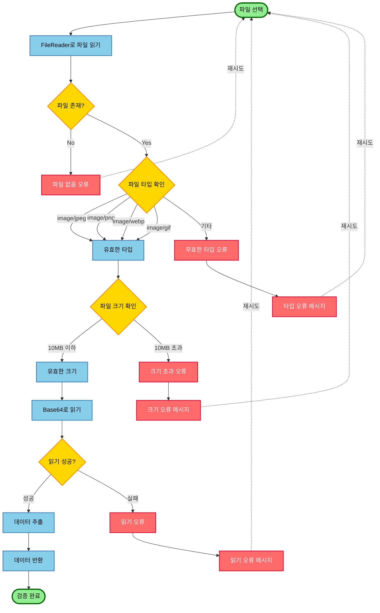
```mermaid
flowchart TD
    Start([파일 선택]):::startEnd
    ReadFile[FileReader로 파일 읽기]:::process
    
    classDef startEnd fill:#90EE90,stroke:#006400,stroke-width:3px,color:#000
    classDef process fill:#87CEEB,stroke:#4682B4,stroke-width:2px,color:#000
    classDef decision fill:#FFD700,stroke:#FF8C00,stroke-width:2px,color:#000
    classDef error fill:#FF6B6B,stroke:#DC143C,stroke-width:2px,color:#fff
    
    Start --> ReadFile
    
    CheckFile{"파일 존재?"}:::decision
    FileNotFound[파일 없음 오류]:::error
    CheckType{"파일 타입 확인"}:::decision
    ValidType[유효한 타입]:::process
    InvalidType[무효한 타입 오류]:::error
    ShowTypeError[타입 오류 메시지]:::error
    
    ReadFile --> CheckFile
    CheckFile -->|No| FileNotFound
    CheckFile -->|Yes| CheckType
    FileNotFound -.->|재시도| Start
    
    CheckType -->|image/jpeg| ValidType
    CheckType -->|image/png| ValidType
    CheckType -->|image/webp| ValidType
    CheckType -->|image/gif| ValidType
    CheckType -->|기타| InvalidType
    InvalidType --> ShowTypeError
    ShowTypeError -.->|재시도| Start
    
    CheckSize{"파일 크기 확인"}:::decision
    ValidSize[유효한 크기]:::process
    InvalidSize[크기 초과 오류]:::error
    ShowSizeError[크기 오류 메시지]:::error
    
    ValidType --> CheckSize
    CheckSize -->|10MB 이하| ValidSize
    CheckSize -->|10MB 초과| InvalidSize
    InvalidSize --> ShowSizeError
    ShowSizeError -.->|재시도| Start
    
    ReadBase64[Base64로 읽기]:::process
    ReadResult{"읽기 성공?"}:::decision
    ExtractData[데이터 추출]:::process
    ReadError[읽기 오류]:::error
    ShowReadError[읽기 오류 메시지]:::error
    ReturnData[데이터 반환]:::process
    End([검증 완료]):::startEnd
    
    ValidSize --> ReadBase64
    ReadBase64 --> ReadResult
    ReadResult -->|성공| ExtractData
    ReadResult -->|실패| ReadError
    ReadError --> ShowReadError
    ShowReadError -.->|재시도| Start
    
    ExtractData --> ReturnData
    ReturnData --> End
```

### 3.2 디자인 분석 프로세스 (백엔드)

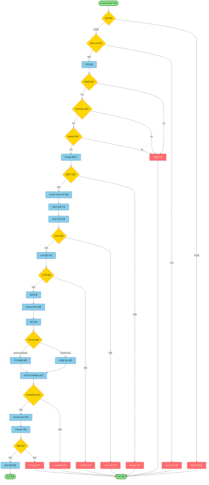
```mermaid
flowchart TD
    Start([analyzeDesign 호출]):::startEnd
    AuthCheck{"인증 확인"}:::decision
    
    classDef startEnd fill:#90EE90,stroke:#006400,stroke-width:3px,color:#000
    classDef process fill:#87CEEB,stroke:#4682B4,stroke-width:2px,color:#000
    classDef decision fill:#FFD700,stroke:#FF8C00,stroke-width:2px,color:#000
    classDef error fill:#FF6B6B,stroke:#DC143C,stroke-width:2px,color:#fff
    
    Start --> AuthCheck
    
    RateLimit{"Rate Limit 체크"}:::decision
    ErrorAuth[인증 오류 반환]:::error
    ValidateInput[입력 검증]:::process
    ErrorRate[Rate Limit 오류]:::error
    
    AuthCheck -->|인증됨| RateLimit
    AuthCheck -->|미인증| ErrorAuth
    
    RateLimit -->|통과| ValidateInput
    RateLimit -->|초과| ErrorRate
    
    ValidateFileName{"파일명 유효?"}:::decision
    ValidateMime{"mimeType 유효?"}:::decision
    ErrorValidation[파일명 오류]:::error
    ValidateBase64{"base64 유효?"}:::decision
    
    ValidateInput --> ValidateFileName
    ValidateFileName -->|Yes| ValidateMime
    ValidateFileName -->|No| ErrorValidation
    ValidateMime -->|Yes| ValidateBase64
    ValidateMime -->|No| ErrorValidation
    ValidateBase64 -->|Yes| UploadStorage
    ValidateBase64 -->|No| ErrorValidation
    
    UploadStorage[Storage 업로드]:::process
    UploadResult{"업로드 성공?"}:::decision
    CallVision[Gemini Vision API 호출]:::process
    ErrorStorage[Storage 오류]:::error
    
    UploadStorage --> UploadResult
    UploadResult -->|성공| CallVision
    UploadResult -->|실패| ErrorStorage
    
    VisionConfig[Vision 설정 구성]:::process
    VisionRequest[Vision 요청 전송]:::process
    VisionResponse{"Vision 응답"}:::decision
    ParseLLM[LLM 응답 파싱]:::process
    ErrorVision[Vision API 오류]:::error
    
    CallVision --> VisionConfig
    VisionConfig --> VisionRequest
    VisionRequest --> VisionResponse
    VisionResponse -->|성공| ParseLLM
    VisionResponse -->|실패| ErrorVision
    
    ValidateLLMSchema{"스키마 검증"}:::decision
    SanitizeResponse[응답 정제]:::process
    ErrorLLM[LLM 응답 오류]:::error
    
    ParseLLM --> ValidateLLMSchema
    ValidateLLMSchema -->|유효| SanitizeResponse
    ValidateLLMSchema -->|무효| ErrorLLM
    
    ConvertFormat[Firestore 형식 변환]:::process
    GenerateDiagnosis[진단 생성]:::process
    CheckFixscope{"fixScope 결정"}:::decision
    SetRebuild[구조 재설계 설정]:::process
    SetTuning[디테일 튜닝 설정]:::process
    GenerateEmbedding[이미지 Embedding 생성]:::process
    
    SanitizeResponse --> ConvertFormat
    ConvertFormat --> GenerateDiagnosis
    GenerateDiagnosis --> CheckFixscope
    CheckFixscope -->|StructureRebuild| SetRebuild
    CheckFixscope -->|DetailTuning| SetTuning
    SetRebuild --> GenerateEmbedding
    SetTuning --> GenerateEmbedding
    
    EmbeddingResult{"Embedding 성공?"}:::decision
    PrepareDoc[Firestore 문서 준비]:::process
    ErrorEmbedding[Embedding 오류]:::error
    
    GenerateEmbedding --> EmbeddingResult
    EmbeddingResult -->|성공| PrepareDoc
    EmbeddingResult -->|실패| ErrorEmbedding
    
    SaveFirestore[Firestore 저장]:::process
    SaveResult{"저장 성공?"}:::decision
    ReturnSuccess[성공 응답 반환]:::process
    ErrorFirestore[Firestore 오류]:::error
    
    PrepareDoc --> SaveFirestore
    SaveFirestore --> SaveResult
    SaveResult -->|성공| ReturnSuccess
    SaveResult -->|실패| ErrorFirestore
    
    EndError([오류 종료]):::startEnd
    EndSuccess([성공 종료]):::startEnd
    
    ErrorAuth --> EndError
    ErrorRate --> EndError
    ErrorValidation --> EndError
    ErrorStorage --> EndError
    ErrorVision --> EndError
    ErrorLLM --> EndError
    ErrorEmbedding --> EndError
    ErrorFirestore --> EndError
    
    ReturnSuccess --> EndSuccess
```

### 3.3 유사 디자인 검색 (벡터 검색)

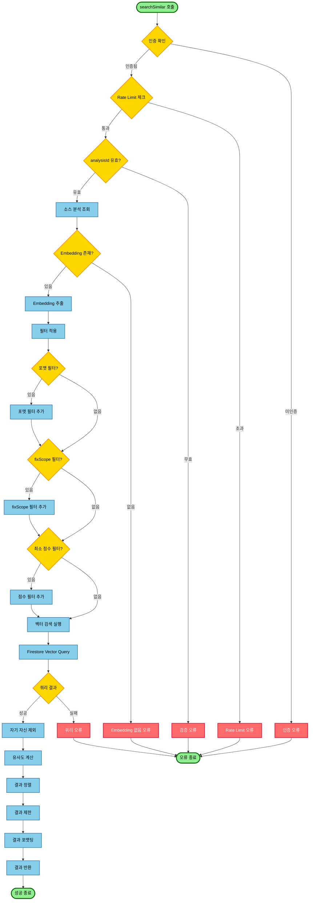
```mermaid
flowchart TD
    Start([searchSimilar 호출]):::startEnd
    AuthCheck{"인증 확인"}:::decision
    
    classDef startEnd fill:#90EE90,stroke:#006400,stroke-width:3px,color:#000
    classDef process fill:#87CEEB,stroke:#4682B4,stroke-width:2px,color:#000
    classDef decision fill:#FFD700,stroke:#FF8C00,stroke-width:2px,color:#000
    classDef error fill:#FF6B6B,stroke:#DC143C,stroke-width:2px,color:#fff
    
    Start --> AuthCheck
    
    RateLimit{"Rate Limit 체크"}:::decision
    ErrorAuth[인증 오류]:::error
    ValidateAnalysisID{"analysisId 유효?"}:::decision
    ErrorRate[Rate Limit 오류]:::error
    
    AuthCheck -->|인증됨| RateLimit
    AuthCheck -->|미인증| ErrorAuth
    
    RateLimit -->|통과| ValidateAnalysisID
    RateLimit -->|초과| ErrorRate
    
    GetSourceAnalysis[소스 분석 조회]:::process
    ErrorValidation[검증 오류]:::error
    CheckEmbedding{"Embedding 존재?"}:::decision
    GetEmbedding[Embedding 추출]:::process
    ErrorNoEmbedding[Embedding 없음 오류]:::error
    
    ValidateAnalysisID -->|유효| GetSourceAnalysis
    ValidateAnalysisID -->|무효| ErrorValidation
    
    GetSourceAnalysis --> CheckEmbedding
    CheckEmbedding -->|있음| GetEmbedding
    CheckEmbedding -->|없음| ErrorNoEmbedding
    
    ApplyFilters[필터 적용]:::process
    CheckFormatFilter{"포맷 필터?"}:::decision
    AddFormatFilter[포맷 필터 추가]:::process
    CheckScopeFilter{"fixScope 필터?"}:::decision
    AddScopeFilter[fixScope 필터 추가]:::process
    CheckScoreFilter{"최소 점수 필터?"}:::decision
    AddScoreFilter[점수 필터 추가]:::process
    ExecuteVectorSearch[벡터 검색 실행]:::process
    
    GetEmbedding --> ApplyFilters
    ApplyFilters --> CheckFormatFilter
    CheckFormatFilter -->|있음| AddFormatFilter
    CheckFormatFilter -->|없음| CheckScopeFilter
    AddFormatFilter --> CheckScopeFilter
    CheckScopeFilter -->|있음| AddScopeFilter
    CheckScopeFilter -->|없음| CheckScoreFilter
    AddScopeFilter --> CheckScoreFilter
    CheckScoreFilter -->|있음| AddScoreFilter
    CheckScoreFilter -->|없음| ExecuteVectorSearch
    AddScoreFilter --> ExecuteVectorSearch
    
    VectorQuery[Firestore Vector Query]:::process
    QueryResult{"쿼리 결과"}:::decision
    FilterSelf[자기 자신 제외]:::process
    ErrorQuery[쿼리 오류]:::error
    
    ExecuteVectorSearch --> VectorQuery
    VectorQuery --> QueryResult
    QueryResult -->|성공| FilterSelf
    QueryResult -->|실패| ErrorQuery
    
    CalculateSimilarity[유사도 계산]:::process
    SortResults[결과 정렬]:::process
    LimitResults[결과 제한]:::process
    FormatResults[결과 포맷팅]:::process
    ReturnResults[결과 반환]:::process
    EndSuccess([성공 종료]):::startEnd
    
    FilterSelf --> CalculateSimilarity
    CalculateSimilarity --> SortResults
    SortResults --> LimitResults
    LimitResults --> FormatResults
    FormatResults --> ReturnResults
    ReturnResults --> EndSuccess
    
    EndError([오류 종료]):::startEnd
    
    ErrorAuth --> EndError
    ErrorRate --> EndError
    ErrorValidation --> EndError
    ErrorNoEmbedding --> EndError
    ErrorQuery --> EndError
```

### 3.4 AI 멘토링 챗 (세션 관리 포함)

```mermaid
flowchart TD
    Start([chatWithMentor 호출]):::startEnd
    AuthCheck{"인증 확인"}:::decision
    
    classDef startEnd fill:#90EE90,stroke:#006400,stroke-width:3px,color:#000
    classDef process fill:#87CEEB,stroke:#4682B4,stroke-width:2px,color:#000
    classDef decision fill:#FFD700,stroke:#FF8C00,stroke-width:2px,color:#000
    classDef error fill:#FF6B6B,stroke:#DC143C,stroke-width:2px,color:#fff
    
    Start --> AuthCheck
    
    RateLimit{"Rate Limit 체크"}:::decision
    ErrorAuth[인증 오류]:::error
    ValidateInput[입력 검증]:::process
    ErrorRate[Rate Limit 오류]:::error
    
    AuthCheck -->|인증됨| RateLimit
    AuthCheck -->|미인증| ErrorAuth
    
    RateLimit -->|통과| ValidateInput
    RateLimit -->|초과| ErrorRate
    
    ValidateMessage{"메시지 유효?"}:::decision
    ValidateAnalysisID{"analysisId 유효?"}:::decision
    ErrorValidation[메시지 오류]:::error
    
    ValidateInput --> ValidateMessage
    ValidateMessage -->|Yes| ValidateAnalysisID
    ValidateMessage -->|No| ErrorValidation
    ValidateAnalysisID -->|유효| GetAnalysis
    ValidateAnalysisID -->|무효| ErrorValidation
    
    GetAnalysis[분석 데이터 조회]:::process
    CheckSession{"sessionId 존재?"}:::decision
    GetSession[세션 데이터 조회]:::process
    CreateSession[새 세션 생성]:::process
    ValidateSession{"세션 유효?"}:::decision
    LoadHistory[대화 히스토리 로드]:::process
    InitHistory[빈 히스토리 초기화]:::process
    
    GetAnalysis --> CheckSession
    CheckSession -->|있음| GetSession
    CheckSession -->|없음| CreateSession
    GetSession --> ValidateSession
    ValidateSession -->|유효| LoadHistory
    ValidateSession -->|무효| CreateSession
    CreateSession --> InitHistory
    
    AppendUserMsg[사용자 메시지 추가]:::process
    BuildContext[컨텍스트 구성]:::process
    BuildSystemInstruction[시스템 지시사항 구성]:::process
    CheckFixscope{"fixScope 확인"}:::decision
    
    LoadHistory --> AppendUserMsg
    InitHistory --> AppendUserMsg
    AppendUserMsg --> BuildContext
    BuildContext --> BuildSystemInstruction
    BuildSystemInstruction --> CheckFixscope
    
    RebuildInstruction[구조 재설계 지시사항]:::process
    TuningInstruction[디테일 튜닝 지시사항]:::process
    CallChatAPI[Gemini Chat API 호출]:::process
    ChatResponse{"챗 응답"}:::decision
    
    CheckFixscope -->|StructureRebuild| RebuildInstruction
    CheckFixscope -->|DetailTuning| TuningInstruction
    RebuildInstruction --> CallChatAPI
    TuningInstruction --> CallChatAPI
    CallChatAPI --> ChatResponse
    
    ParseResponse[응답 파싱]:::process
    ErrorChat[챗 API 오류]:::error
    SaveMessage[메시지 저장]:::process
    UpdateSession[세션 업데이트]:::process
    UpdateResult{"업데이트 성공?"}:::decision
    ReturnResponse[응답 반환]:::process
    ErrorSession[세션 업데이트 오류]:::error
    
    ChatResponse -->|성공| ParseResponse
    ChatResponse -->|실패| ErrorChat
    ParseResponse --> SaveMessage
    SaveMessage --> UpdateSession
    UpdateSession --> UpdateResult
    UpdateResult -->|성공| ReturnResponse
    UpdateResult -->|실패| ErrorSession
    
    EndSuccess([성공 종료]):::startEnd
    EndError([오류 종료]):::startEnd
    
    ReturnResponse --> EndSuccess
    
    ErrorAuth --> EndError
    ErrorRate --> EndError
    ErrorValidation --> EndError
    ErrorChat --> EndError
    ErrorSession --> EndError
```

### 3.5 사용자 인증 (익명 인증)

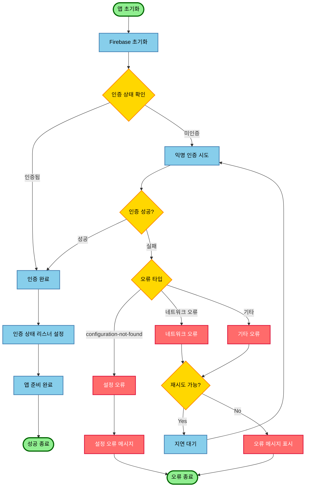
```mermaid
flowchart TD
    Start([앱 초기화]):::startEnd
    InitFirebase[Firebase 초기화]:::process
    
    classDef startEnd fill:#90EE90,stroke:#006400,stroke-width:3px,color:#000
    classDef process fill:#87CEEB,stroke:#4682B4,stroke-width:2px,color:#000
    classDef decision fill:#FFD700,stroke:#FF8C00,stroke-width:2px,color:#000
    classDef error fill:#FF6B6B,stroke:#DC143C,stroke-width:2px,color:#fff
    
    Start --> InitFirebase
    
    CheckAuthState{"인증 상태 확인"}:::decision
    AuthSuccess[인증 완료]:::process
    AttemptSignin[익명 인증 시도]:::process
    SignInResult{"인증 성공?"}:::decision
    
    InitFirebase --> CheckAuthState
    CheckAuthState -->|인증됨| AuthSuccess
    CheckAuthState -->|미인증| AttemptSignin
    AttemptSignin --> SignInResult
    SignInResult -->|성공| AuthSuccess
    
    CheckError{"오류 타입"}:::decision
    ConfigError[설정 오류]:::error
    NetworkError[네트워크 오류]:::error
    OtherError[기타 오류]:::error
    
    SignInResult -->|실패| CheckError
    CheckError -->|configuration-not-found| ConfigError
    CheckError -->|네트워크 오류| NetworkError
    CheckError -->|기타| OtherError
    
    ShowConfigError[설정 오류 메시지]:::error
    RetryLogic{"재시도 가능?"}:::decision
    WaitDelay[지연 대기]:::process
    ShowError[오류 메시지 표시]:::error
    
    ConfigError --> ShowConfigError
    NetworkError --> RetryLogic
    OtherError --> RetryLogic
    RetryLogic -->|Yes| WaitDelay
    WaitDelay --> AttemptSignin
    RetryLogic -->|No| ShowError
    
    EndError([오류 종료]):::startEnd
    SetupListener[인증 상태 리스너 설정]:::process
    Ready[앱 준비 완료]:::process
    End([성공 종료]):::startEnd
    
    ShowConfigError --> EndError
    ShowError --> EndError
    
    AuthSuccess --> SetupListener
    SetupListener --> Ready
    Ready --> End
```

---

## 4. 전체 정보구조

### 4.1 Firestore 데이터 모델

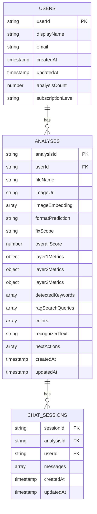
```mermaid
erDiagram
    USERS ||--o{ ANALYSES : "has"
    ANALYSES ||--o{ CHAT_SESSIONS : "has"
    
    USERS {
        string userId PK
        string displayName
        string email
        timestamp createdAt
        timestamp updatedAt
        number analysisCount
        string subscriptionLevel
    }
    
    ANALYSES {
        string analysisId PK
        string userId FK
        string fileName
        string imageUrl
        array imageEmbedding
        string formatPrediction
        string fixScope
        number overallScore
        object layer1Metrics
        object layer2Metrics
        object layer3Metrics
        array detectedKeywords
        array ragSearchQueries
        array colors
        string recognizedText
        array nextActions
        timestamp createdAt
        timestamp updatedAt
    }
    
    CHAT_SESSIONS {
        string sessionId PK
        string analysisId FK
        string userId FK
        array messages
        timestamp createdAt
        timestamp updatedAt
    }
```

### 4.2 프론트엔드 상태 관리

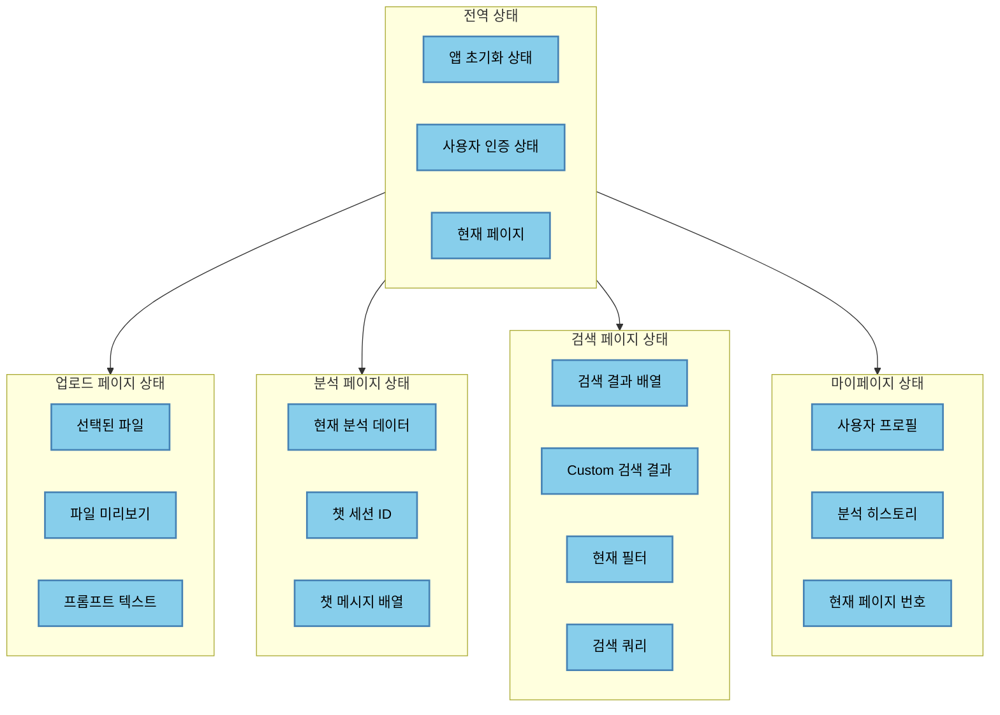
```mermaid
graph TD
    subgraph GlobalState ["전역 상태"]
        AppInit[앱 초기화 상태]:::process
        UserAuth[사용자 인증 상태]:::process
        CurrentPage[현재 페이지]:::process
    end
    
    classDef startEnd fill:#90EE90,stroke:#006400,stroke-width:3px,color:#000
    classDef process fill:#87CEEB,stroke:#4682B4,stroke-width:2px,color:#000
    classDef decision fill:#FFD700,stroke:#FF8C00,stroke-width:2px,color:#000
    classDef error fill:#FF6B6B,stroke:#DC143C,stroke-width:2px,color:#fff
    
    subgraph UploadState ["업로드 페이지 상태"]
        SelectedFile[선택된 파일]:::process
        FilePreview[파일 미리보기]:::process
        PromptText[프롬프트 텍스트]:::process
    end
    
    subgraph AnalyzeState ["분석 페이지 상태"]
        CurrentAnalysis[현재 분석 데이터]:::process
        ChatSessionID[챗 세션 ID]:::process
        ChatMessages[챗 메시지 배열]:::process
    end
    
    subgraph SearchState ["검색 페이지 상태"]
        SearchResults[검색 결과 배열]:::process
        CustomSearchResults[Custom 검색 결과]:::process
        CurrentFilters[현재 필터]:::process
        SearchQuery[검색 쿼리]:::process
    end
    
    subgraph MypageState ["마이페이지 상태"]
        UserProfile[사용자 프로필]:::process
        AnalysisHistory[분석 히스토리]:::process
        CurrentPageNum[현재 페이지 번호]:::process
    end
    
    GlobalState --> UploadState
    GlobalState --> AnalyzeState
    GlobalState --> SearchState
    GlobalState --> MypageState
```

### 4.3 로컬 스토리지 사용

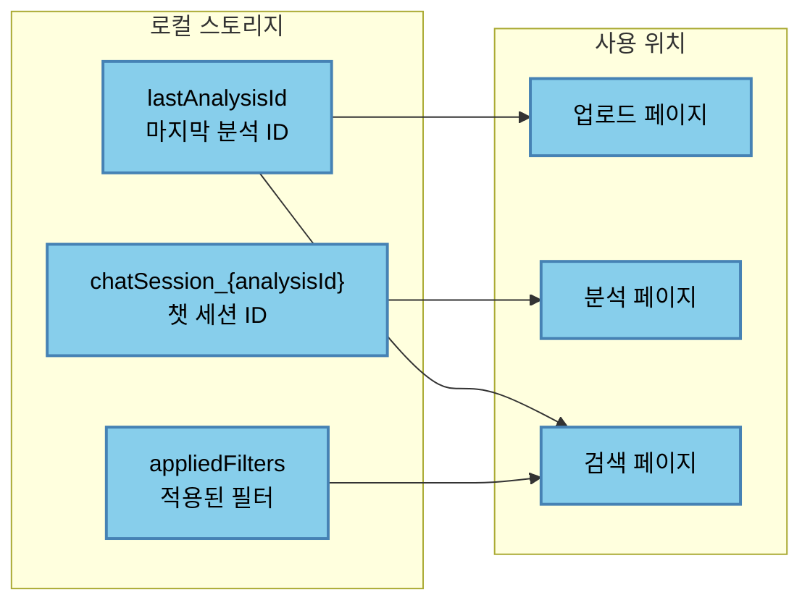
```mermaid
graph LR
    subgraph LocalStorage ["로컬 스토리지"]
        LastAnalysisID["lastAnalysisId<br/>마지막 분석 ID"]:::process
        ChatSessions["chatSession_{analysisId}<br/>챗 세션 ID"]:::process
        AppliedFilters["appliedFilters<br/>적용된 필터"]:::process
    end
    
    classDef startEnd fill:#90EE90,stroke:#006400,stroke-width:3px,color:#000
    classDef process fill:#87CEEB,stroke:#4682B4,stroke-width:2px,color:#000
    classDef decision fill:#FFD700,stroke:#FF8C00,stroke-width:2px,color:#000
    classDef error fill:#FF6B6B,stroke:#DC143C,stroke-width:2px,color:#fff
    
    subgraph Usage ["사용 위치"]
        UploadPage[업로드 페이지]:::process
        AnalyzePage[분석 페이지]:::process
        SearchPage[검색 페이지]:::process
    end
    
    LastAnalysisID --> UploadPage
    LastAnalysisID --> SearchPage
    ChatSessions --> AnalyzePage
    AppliedFilters --> SearchPage
```

---

## 5. 전체 사이트맵

### 5.1 페이지 계층 구조

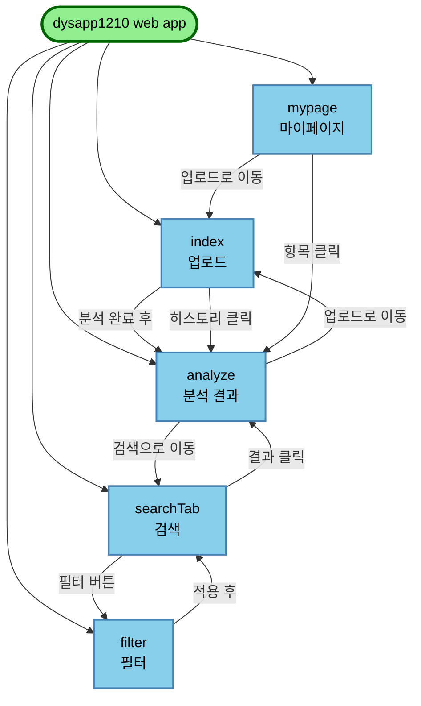
```mermaid
graph TD
    Root([dysapp1210 web app]):::startEnd
    Index[index<br/>업로드]:::process
    Analyze[analyze<br/>분석 결과]:::process
    Search[searchTab<br/>검색]:::process
    Filter[filter<br/>필터]:::process
    Mypage[mypage<br/>마이페이지]:::process
    
    classDef startEnd fill:#90EE90,stroke:#006400,stroke-width:3px,color:#000
    classDef process fill:#87CEEB,stroke:#4682B4,stroke-width:2px,color:#000
    classDef decision fill:#FFD700,stroke:#FF8C00,stroke-width:2px,color:#000
    classDef error fill:#FF6B6B,stroke:#DC143C,stroke-width:2px,color:#fff
    
    Root --> Index
    Root --> Analyze
    Root --> Search
    Root --> Filter
    Root --> Mypage
    
    Index -->|분석 완료 후| Analyze
    Index -->|히스토리 클릭| Analyze
    
    Search -->|결과 클릭| Analyze
    Search -->|필터 버튼| Filter
    Filter -->|적용 후| Search
    
    Mypage -->|항목 클릭| Analyze
    Mypage -->|업로드로 이동| Index
    
    Analyze -->|검색으로 이동| Search
    Analyze -->|업로드로 이동| Index
```

### 5.2 네비게이션 흐름

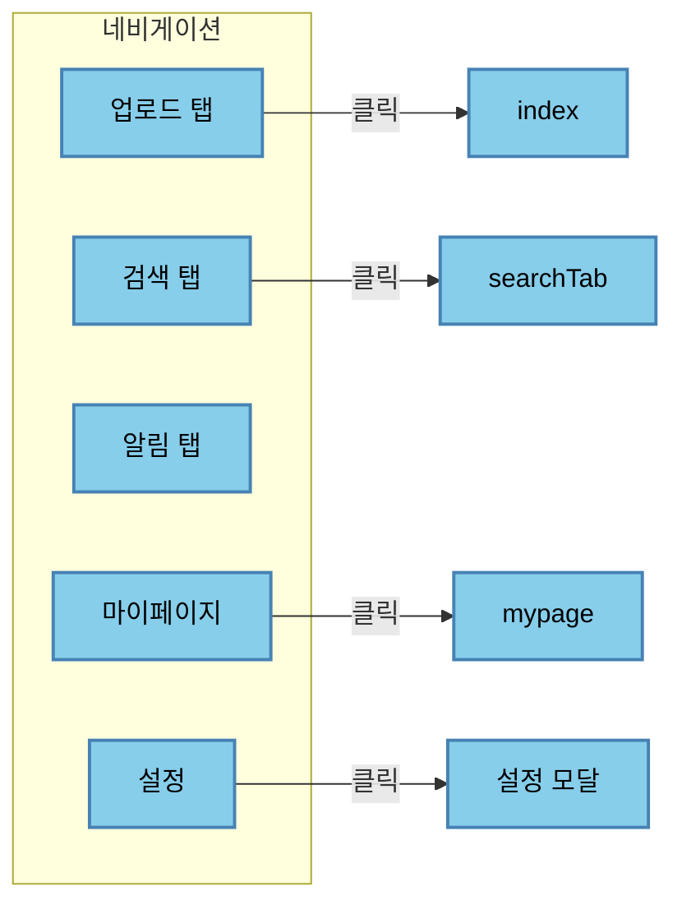
```mermaid
graph LR
    subgraph Nav ["네비게이션"]
        UploadTab[업로드 탭]:::process
        SearchTab[검색 탭]:::process
        AlertTab[알림 탭]:::process
        MypageBtn[마이페이지]:::process
        SettingsBtn[설정]:::process
    end
    
    classDef startEnd fill:#90EE90,stroke:#006400,stroke-width:3px,color:#000
    classDef process fill:#87CEEB,stroke:#4682B4,stroke-width:2px,color:#000
    classDef decision fill:#FFD700,stroke:#FF8C00,stroke-width:2px,color:#000
    classDef error fill:#FF6B6B,stroke:#DC143C,stroke-width:2px,color:#fff
    
    UploadTab -->|클릭| Index[index]:::process
    SearchTab -->|클릭| Search[searchTab]:::process
    MypageBtn -->|클릭| Mypage[mypage]:::process
    SettingsBtn -->|클릭| Settings[설정 모달]:::process
```

---

## 6. 태스크 플로우

### 6.1 새 디자인 분석하기

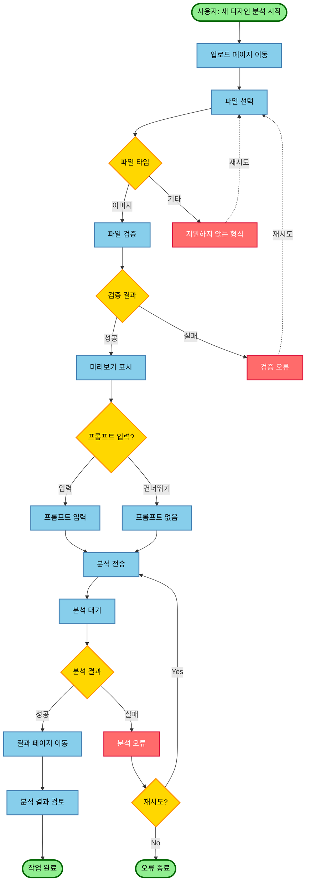
```mermaid
flowchart TD
    Start([사용자: 새 디자인 분석 시작]):::startEnd
    GoUpload[업로드 페이지 이동]:::process
    
    classDef startEnd fill:#90EE90,stroke:#006400,stroke-width:3px,color:#000
    classDef process fill:#87CEEB,stroke:#4682B4,stroke-width:2px,color:#000
    classDef decision fill:#FFD700,stroke:#FF8C00,stroke-width:2px,color:#000
    classDef error fill:#FF6B6B,stroke:#DC143C,stroke-width:2px,color:#fff
    
    Start --> GoUpload
    
    SelectFile[파일 선택]:::process
    FileType{"파일 타입"}:::decision
    ValidateFile[파일 검증]:::process
    FileError[지원하지 않는 형식]:::error
    ValidationResult{"검증 결과"}:::decision
    ShowPreview[미리보기 표시]:::process
    ValidationError[검증 오류]:::error
    
    GoUpload --> SelectFile
    SelectFile --> FileType
    FileType -->|이미지| ValidateFile
    FileType -->|기타| FileError
    FileError -.->|재시도| SelectFile
    
    ValidateFile --> ValidationResult
    ValidationResult -->|성공| ShowPreview
    ValidationResult -->|실패| ValidationError
    ValidationError -.->|재시도| SelectFile
    
    OptionalPrompt{"프롬프트 입력?"}:::decision
    EnterPrompt[프롬프트 입력]:::process
    SkipPrompt[프롬프트 없음]:::process
    SendAnalysis[분석 전송]:::process
    WaitAnalysis[분석 대기]:::process
    AnalysisResult{"분석 결과"}:::decision
    
    ShowPreview --> OptionalPrompt
    OptionalPrompt -->|입력| EnterPrompt
    OptionalPrompt -->|건너뛰기| SkipPrompt
    EnterPrompt --> SendAnalysis
    SkipPrompt --> SendAnalysis
    SendAnalysis --> WaitAnalysis
    WaitAnalysis --> AnalysisResult
    
    ViewResults[결과 페이지 이동]:::process
    AnalysisError[분석 오류]:::error
    RetryDecision{"재시도?"}:::decision
    EndError([오류 종료]):::startEnd
    ReviewAnalysis[분석 결과 검토]:::process
    EndSuccess([작업 완료]):::startEnd
    
    AnalysisResult -->|성공| ViewResults
    AnalysisResult -->|실패| AnalysisError
    AnalysisError --> RetryDecision
    RetryDecision -->|Yes| SendAnalysis
    RetryDecision -->|No| EndError
    
    ViewResults --> ReviewAnalysis
    ReviewAnalysis --> EndSuccess
```

### 6.2 유사 디자인 찾기

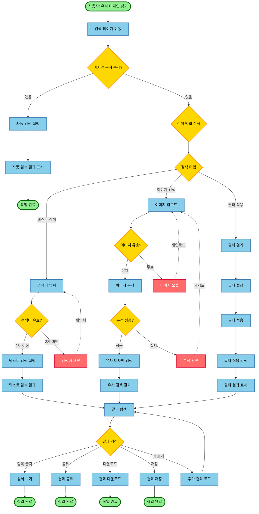
```mermaid
flowchart TD
    Start([사용자: 유사 디자인 찾기]):::startEnd
    GoSearch[검색 페이지 이동]:::process
    
    classDef startEnd fill:#90EE90,stroke:#006400,stroke-width:3px,color:#000
    classDef process fill:#87CEEB,stroke:#4682B4,stroke-width:2px,color:#000
    classDef decision fill:#FFD700,stroke:#FF8C00,stroke-width:2px,color:#000
    classDef error fill:#FF6B6B,stroke:#DC143C,stroke-width:2px,color:#fff
    
    Start --> GoSearch
    
    CheckLast{"마지막 분석 존재?"}:::decision
    AutoSearch[자동 검색 실행]:::process
    ShowAutoResults[자동 검색 결과 표시]:::process
    EndAuto([작업 완료]):::startEnd
    ChooseMethod{"검색 방법 선택"}:::decision
    
    GoSearch --> CheckLast
    CheckLast -->|있음| AutoSearch
    CheckLast -->|없음| ChooseMethod
    AutoSearch --> ShowAutoResults
    ShowAutoResults --> EndAuto
    
    MethodType{"검색 타입"}:::decision
    EnterText[검색어 입력]:::process
    UploadImage[이미지 업로드]:::process
    OpenFilter[필터 열기]:::process
    
    ChooseMethod --> MethodType
    MethodType -->|텍스트 검색| EnterText
    MethodType -->|이미지 검색| UploadImage
    MethodType -->|필터 적용| OpenFilter
    
    ValidateText{"검색어 유효?"}:::decision
    TextSearch[텍스트 검색 실행]:::process
    TextError[검색어 오류]:::error
    
    EnterText --> ValidateText
    ValidateText -->|2자 이상| TextSearch
    ValidateText -->|2자 미만| TextError
    TextError -.->|재입력| EnterText
    
    ValidateImg{"이미지 유효?"}:::decision
    AnalyzeFirst[이미지 분석]:::process
    ImgError[이미지 오류]:::error
    AnalyzeSuccess{"분석 성공?"}:::decision
    SimilarSearch[유사 디자인 검색]:::process
    AnalyzeError[분석 오류]:::error
    
    UploadImage --> ValidateImg
    ValidateImg -->|유효| AnalyzeFirst
    ValidateImg -->|무효| ImgError
    ImgError -.->|재업로드| UploadImage
    
    AnalyzeFirst --> AnalyzeSuccess
    AnalyzeSuccess -->|성공| SimilarSearch
    AnalyzeSuccess -->|실패| AnalyzeError
    AnalyzeError -.->|재시도| UploadImage
    
    ShowTextResults[텍스트 검색 결과]:::process
    ShowSimilarResults[유사 검색 결과]:::process
    
    TextSearch --> ShowTextResults
    SimilarSearch --> ShowSimilarResults
    
    SetFilters[필터 설정]:::process
    ApplyFilters[필터 적용]:::process
    FilteredSearch[필터 적용 검색]:::process
    ShowFilteredResults[필터 결과 표시]:::process
    
    OpenFilter --> SetFilters
    SetFilters --> ApplyFilters
    ApplyFilters --> FilteredSearch
    FilteredSearch --> ShowFilteredResults
    
    BrowseResults[결과 탐색]:::process
    ResultAction{"결과 액션"}:::decision
    
    ShowTextResults --> BrowseResults
    ShowSimilarResults --> BrowseResults
    ShowFilteredResults --> BrowseResults
    
    BrowseResults --> ResultAction
    
    ViewDetail[상세 보기]:::process
    ShareResult[결과 공유]:::process
    DownloadResult[결과 다운로드]:::process
    SaveResult[결과 저장]:::process
    LoadMore[추가 결과 로드]:::process
    
    ResultAction -->|항목 클릭| ViewDetail
    ResultAction -->|공유| ShareResult
    ResultAction -->|다운로드| DownloadResult
    ResultAction -->|저장| SaveResult
    ResultAction -->|더 보기| LoadMore
    
    EndDetail([작업 완료]):::startEnd
    EndShare([작업 완료]):::startEnd
    EndDownload([작업 완료]):::startEnd
    EndSave([작업 완료]):::startEnd
    
    ViewDetail --> EndDetail
    ShareResult --> EndShare
    DownloadResult --> EndDownload
    SaveResult --> EndSave
    
    LoadMore --> BrowseResults
```

### 6.3 AI 멘토와 대화하기

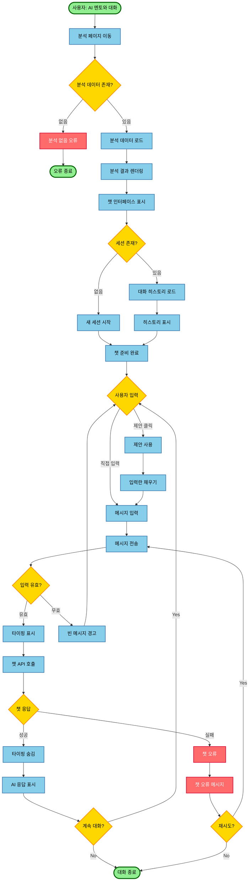
```mermaid
flowchart TD
    Start([사용자: AI 멘토와 대화]):::startEnd
    GoAnalyze[분석 페이지 이동]:::process
    
    classDef startEnd fill:#90EE90,stroke:#006400,stroke-width:3px,color:#000
    classDef process fill:#87CEEB,stroke:#4682B4,stroke-width:2px,color:#000
    classDef decision fill:#FFD700,stroke:#FF8C00,stroke-width:2px,color:#000
    classDef error fill:#FF6B6B,stroke:#DC143C,stroke-width:2px,color:#fff
    
    Start --> GoAnalyze
    
    CheckAnalysis{"분석 데이터 존재?"}:::decision
    LoadAnalysis[분석 데이터 로드]:::process
    NoAnalysisError[분석 없음 오류]:::error
    EndError([오류 종료]):::startEnd
    
    GoAnalyze --> CheckAnalysis
    CheckAnalysis -->|있음| LoadAnalysis
    CheckAnalysis -->|없음| NoAnalysisError
    NoAnalysisError --> EndError
    
    RenderAnalysis[분석 결과 렌더링]:::process
    ShowChat[챗 인터페이스 표시]:::process
    CheckSession{"세션 존재?"}:::decision
    LoadHistory[대화 히스토리 로드]:::process
    NewSession[새 세션 시작]:::process
    DisplayHistory[히스토리 표시]:::process
    ReadyChat[챗 준비 완료]:::process
    
    LoadAnalysis --> RenderAnalysis
    RenderAnalysis --> ShowChat
    ShowChat --> CheckSession
    CheckSession -->|있음| LoadHistory
    CheckSession -->|없음| NewSession
    LoadHistory --> DisplayHistory
    NewSession --> ReadyChat
    DisplayHistory --> ReadyChat
    
    UserInput{"사용자 입력"}:::decision
    TypeMessage[메시지 입력]:::process
    UseSuggestion[제안 사용]:::process
    FillInput[입력란 채우기]:::process
    SendMessage[메시지 전송]:::process
    ValidateInput{"입력 유효?"}:::decision
    ShowTyping[타이핑 표시]:::process
    EmptyWarning[빈 메시지 경고]:::process
    
    ReadyChat --> UserInput
    UserInput -->|직접 입력| TypeMessage
    UserInput -->|제안 클릭| UseSuggestion
    UseSuggestion --> FillInput
    FillInput --> TypeMessage
    TypeMessage --> SendMessage
    SendMessage --> ValidateInput
    ValidateInput -->|유효| ShowTyping
    ValidateInput -->|무효| EmptyWarning
    EmptyWarning --> UserInput
    
    CallChatAPI[챗 API 호출]:::process
    ChatResponse{"챗 응답"}:::decision
    HideTyping[타이핑 숨김]:::process
    ChatError[챗 오류]:::error
    DisplayResponse[AI 응답 표시]:::process
    ContinueChat{"계속 대화?"}:::decision
    EndChat([대화 종료]):::startEnd
    
    ShowTyping --> CallChatAPI
    CallChatAPI --> ChatResponse
    ChatResponse -->|성공| HideTyping
    ChatResponse -->|실패| ChatError
    HideTyping --> DisplayResponse
    DisplayResponse --> ContinueChat
    ContinueChat -->|Yes| UserInput
    ContinueChat -->|No| EndChat
    
    ShowChatError[챗 오류 메시지]:::error
    RetryChat{"재시도?"}:::decision
    
    ChatError --> ShowChatError
    ShowChatError --> RetryChat
    RetryChat -->|Yes| SendMessage
    RetryChat -->|No| EndChat
```

---

## 7. 백엔드 기능 프레임워크

### 7.1 Cloud Functions 구조

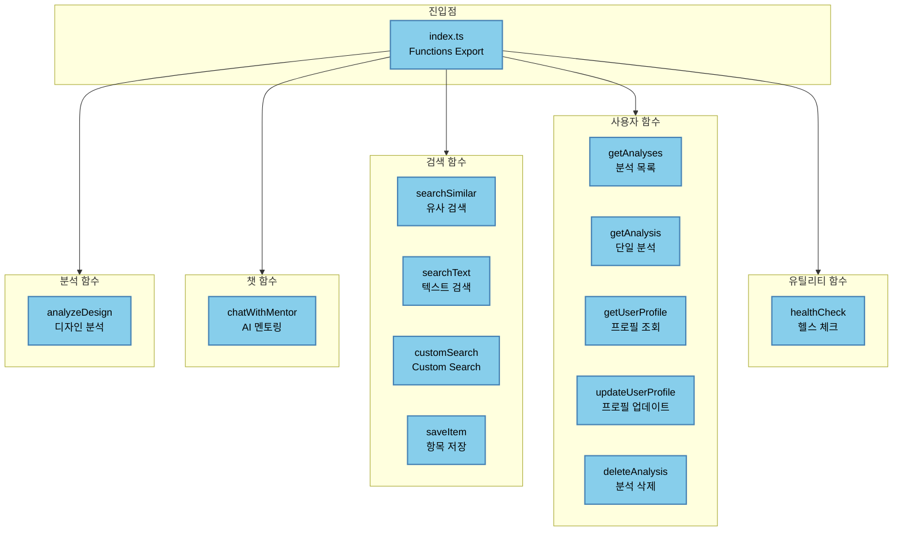
```mermaid
graph TD
    subgraph Entry ["진입점"]
        Index[index.ts<br/>Functions Export]:::process
    end
    
    classDef startEnd fill:#90EE90,stroke:#006400,stroke-width:3px,color:#000
    classDef process fill:#87CEEB,stroke:#4682B4,stroke-width:2px,color:#000
    classDef decision fill:#FFD700,stroke:#FF8C00,stroke-width:2px,color:#000
    classDef error fill:#FF6B6B,stroke:#DC143C,stroke-width:2px,color:#fff
    
    subgraph AnalysisFunctions ["분석 함수"]
        Analyze[analyzeDesign<br/>디자인 분석]:::process
    end
    
    subgraph ChatFunctions ["챗 함수"]
        Chat[chatWithMentor<br/>AI 멘토링]:::process
    end
    
    subgraph SearchFunctions ["검색 함수"]
        Similar[searchSimilar<br/>유사 검색]:::process
        Text[searchText<br/>텍스트 검색]:::process
        Custom[customSearch<br/>Custom Search]:::process
        Save[saveItem<br/>항목 저장]:::process
    end
    
    subgraph UserFunctions ["사용자 함수"]
        GetAnalyses[getAnalyses<br/>분석 목록]:::process
        GetAnalysis[getAnalysis<br/>단일 분석]:::process
        GetProfile[getUserProfile<br/>프로필 조회]:::process
        UpdateProfile[updateUserProfile<br/>프로필 업데이트]:::process
        Delete[deleteAnalysis<br/>분석 삭제]:::process
    end
    
    subgraph UtilFunctions ["유틸리티 함수"]
        Health[healthCheck<br/>헬스 체크]:::process
    end
    
    Index --> AnalysisFunctions
    Index --> ChatFunctions
    Index --> SearchFunctions
    Index --> UserFunctions
    Index --> UtilFunctions
```

### 7.2 API 엔드포인트 매핑

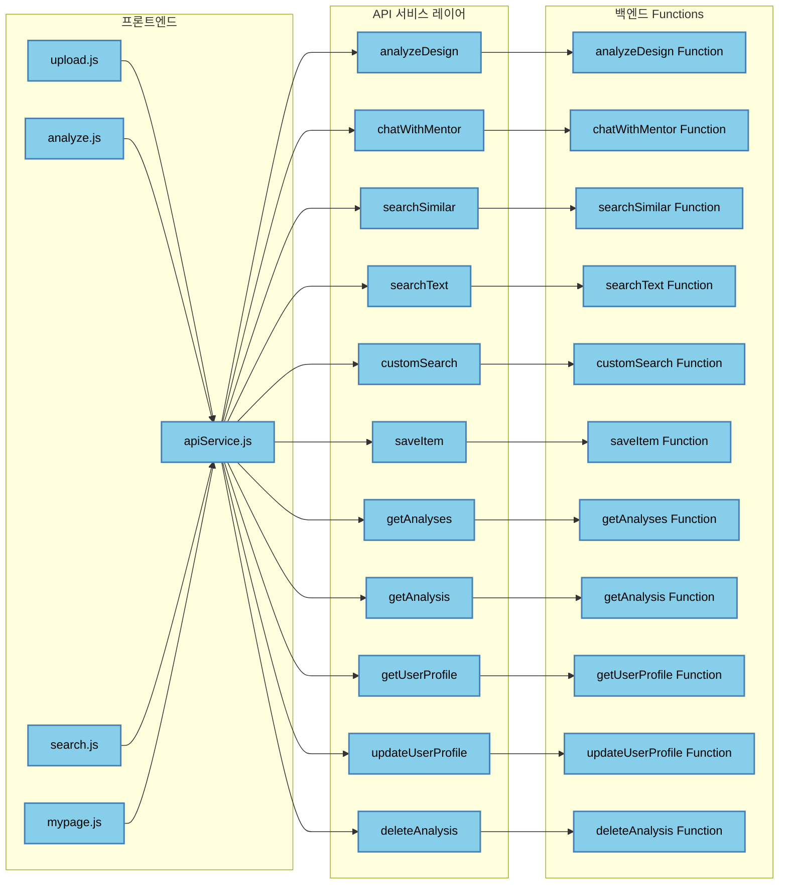
```mermaid
graph LR
    subgraph Frontend ["프론트엔드"]
        UploadJS[upload.js]:::process
        AnalyzeJS[analyze.js]:::process
        SearchJS[search.js]:::process
        MypageJS[mypage.js]:::process
        APIService[apiService.js]:::process
    end
    
    classDef startEnd fill:#90EE90,stroke:#006400,stroke-width:3px,color:#000
    classDef process fill:#87CEEB,stroke:#4682B4,stroke-width:2px,color:#000
    classDef decision fill:#FFD700,stroke:#FF8C00,stroke-width:2px,color:#000
    classDef error fill:#FF6B6B,stroke:#DC143C,stroke-width:2px,color:#fff
    
    subgraph APILayer ["API 서비스 레이어"]
        AnalyzeAPI[analyzeDesign]:::process
        ChatAPI[chatWithMentor]:::process
        SearchSimilarAPI[searchSimilar]:::process
        SearchTextAPI[searchText]:::process
        CustomSearchAPI[customSearch]:::process
        SaveAPI[saveItem]:::process
        GetAnalysesAPI[getAnalyses]:::process
        GetAnalysisAPI[getAnalysis]:::process
        GetProfileAPI[getUserProfile]:::process
        UpdateProfileAPI[updateUserProfile]:::process
        DeleteAPI[deleteAnalysis]:::process
    end
    
    subgraph Backend ["백엔드 Functions"]
        AnalyzeFunc[analyzeDesign Function]:::process
        ChatFunc[chatWithMentor Function]:::process
        SimilarFunc[searchSimilar Function]:::process
        TextFunc[searchText Function]:::process
        CustomFunc[customSearch Function]:::process
        SaveFunc[saveItem Function]:::process
        GetAnalysesFunc[getAnalyses Function]:::process
        GetAnalysisFunc[getAnalysis Function]:::process
        GetProfileFunc[getUserProfile Function]:::process
        UpdateProfileFunc[updateUserProfile Function]:::process
        DeleteFunc[deleteAnalysis Function]:::process
    end
    
    UploadJS --> APIService
    AnalyzeJS --> APIService
    SearchJS --> APIService
    MypageJS --> APIService
    
    APIService --> AnalyzeAPI
    APIService --> ChatAPI
    APIService --> SearchSimilarAPI
    APIService --> SearchTextAPI
    APIService --> CustomSearchAPI
    APIService --> SaveAPI
    APIService --> GetAnalysesAPI
    APIService --> GetAnalysisAPI
    APIService --> GetProfileAPI
    APIService --> UpdateProfileAPI
    APIService --> DeleteAPI
    
    AnalyzeAPI --> AnalyzeFunc
    ChatAPI --> ChatFunc
    SearchSimilarAPI --> SimilarFunc
    SearchTextAPI --> TextFunc
    CustomSearchAPI --> CustomFunc
    SaveAPI --> SaveFunc
    GetAnalysesAPI --> GetAnalysesFunc
    GetAnalysisAPI --> GetAnalysisFunc
    GetProfileAPI --> GetProfileFunc
    UpdateProfileAPI --> UpdateProfileFunc
    DeleteAPI --> DeleteFunc
```

### 7.3 에러 처리 및 폴백 로직

```mermaid
flowchart TD
    Start([Function 호출]):::startEnd
    TryCatch{"Try-Catch 블록"}:::decision
    
    classDef startEnd fill:#90EE90,stroke:#006400,stroke-width:3px,color:#000
    classDef process fill:#87CEEB,stroke:#4682B4,stroke-width:2px,color:#000
    classDef decision fill:#FFD700,stroke:#FF8C00,stroke-width:2px,color:#000
    classDef error fill:#FF6B6B,stroke:#DC143C,stroke-width:2px,color:#fff
    
    Start --> TryCatch
    
    Process[정상 처리]:::process
    CatchError[에러 캐치]:::error
    ErrorType{"에러 타입"}:::decision
    
    TryCatch -->|정상| Process
    TryCatch -->|예외| CatchError
    CatchError --> ErrorType
    
    AuthError[인증 오류 처리]:::error
    RateError[Rate Limit 처리]:::error
    ValidationError[검증 오류 처리]:::error
    APIError[API 오류 처리]:::error
    DBError[DB 오류 처리]:::error
    UnknownError[알 수 없는 오류]:::error
    
    ErrorType -->|인증 오류| AuthError
    ErrorType -->|Rate Limit| RateError
    ErrorType -->|검증 오류| ValidationError
    ErrorType -->|API 오류| APIError
    ErrorType -->|DB 오류| DBError
    ErrorType -->|기타| UnknownError
    
    ReturnAuthError[인증 오류 응답 반환]:::error
    ReturnRateError[Rate Limit 응답 반환]:::error
    ReturnValidationError[검증 오류 응답 반환]:::error
    CheckFallback{"폴백 가능?"}:::decision
    ReturnUnknownError[일반 오류 응답 반환]:::error
    
    AuthError --> ReturnAuthError
    RateError --> ReturnRateError
    ValidationError --> ReturnValidationError
    APIError --> CheckFallback
    DBError --> CheckFallback
    UnknownError --> ReturnUnknownError
    
    UseFallback[폴백 로직 사용]:::process
    ReturnAPIError[API 오류 응답 반환]:::error
    FallbackResult{"폴백 성공?"}:::decision
    ReturnFallback[폴백 응답 반환]:::process
    ReturnSuccess[성공 응답 반환]:::process
    
    CheckFallback -->|Yes| UseFallback
    CheckFallback -->|No| ReturnAPIError
    UseFallback --> FallbackResult
    FallbackResult -->|성공| ReturnFallback
    FallbackResult -->|실패| ReturnAPIError
    
    Process --> ReturnSuccess
    
    EndError([오류 종료]):::startEnd
    EndFallback([폴백 종료]):::startEnd
    EndSuccess([성공 종료]):::startEnd
    
    ReturnAuthError --> EndError
    ReturnRateError --> EndError
    ReturnValidationError --> EndError
    ReturnAPIError --> EndError
    ReturnUnknownError --> EndError
    ReturnFallback --> EndFallback
    ReturnSuccess --> EndSuccess
```

### 7.4 Rate Limiting 흐름

```mermaid
flowchart TD
    Start([Function 호출]):::startEnd
    GetUserID[사용자 ID 추출]:::process
    
    classDef startEnd fill:#90EE90,stroke:#006400,stroke-width:3px,color:#000
    classDef process fill:#87CEEB,stroke:#4682B4,stroke-width:2px,color:#000
    classDef decision fill:#FFD700,stroke:#FF8C00,stroke-width:2px,color:#000
    classDef error fill:#FF6B6B,stroke:#DC143C,stroke-width:2px,color:#fff
    
    Start --> GetUserID
    
    CheckRateLimit{"Rate Limit 체크"}:::decision
    GetLimitConfig[제한 설정 조회]:::process
    CheckCount{"현재 카운트 확인"}:::decision
    CompareLimit{"카운트 < 제한?"}:::decision
    
    GetUserID --> CheckRateLimit
    CheckRateLimit --> GetLimitConfig
    GetLimitConfig --> CheckCount
    CheckCount --> CompareLimit
    
    IncrementCount[카운트 증가]:::process
    RateLimitExceeded[Rate Limit 초과]:::error
    AllowRequest[요청 허용]:::process
    DenyRequest[요청 거부]:::error
    
    CompareLimit -->|Yes| IncrementCount
    CompareLimit -->|No| RateLimitExceeded
    IncrementCount --> AllowRequest
    RateLimitExceeded --> DenyRequest
    
    ProcessRequest[요청 처리]:::process
    DecrementCount[카운트 감소]:::process
    ReturnSuccess[성공 응답]:::process
    ReturnRateError[Rate Limit 오류 응답]:::error
    
    AllowRequest --> ProcessRequest
    ProcessRequest --> DecrementCount
    DecrementCount --> ReturnSuccess
    DenyRequest --> ReturnRateError
    
    EndSuccess([성공 종료]):::startEnd
    EndError([오류 종료]):::startEnd
    
    ReturnSuccess --> EndSuccess
    ReturnRateError --> EndError
```

---

## 참고사항

### 차트 스타일 가이드

- **시작 노드**: 초록색 (#90EE90)
- **성공 종료**: 초록색 (#90EE90)
- **오류 종료**: 빨간색 (#FF6B6B)
- **결정 노드**: 노란색 (#FFD700)
- **프로세스 노드**: 파란색 (#87CEEB)
- **오류 처리**: 빨간색 (#FF6B6B)
- **정상 플로우**: 실선 화살표 `-->`
- **오류 플로우**: 점선 화살표 `-.->`

### 노드 명명 규칙

- `Start`: 시작 노드
- `*`: 프로세스 노드
- `{*}`: 결정 노드
- `Error*`: 오류 노드
- `End*`: 종료 노드

### 업데이트 이력

- **v1.0.0** (2025-01-XX): 초기 문서 작성
