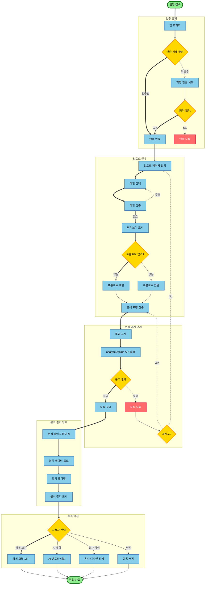
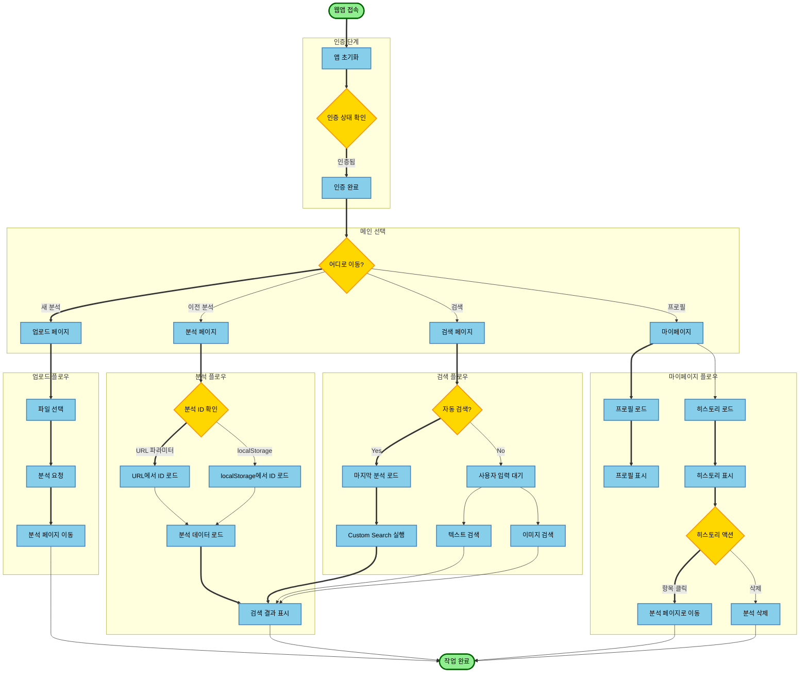
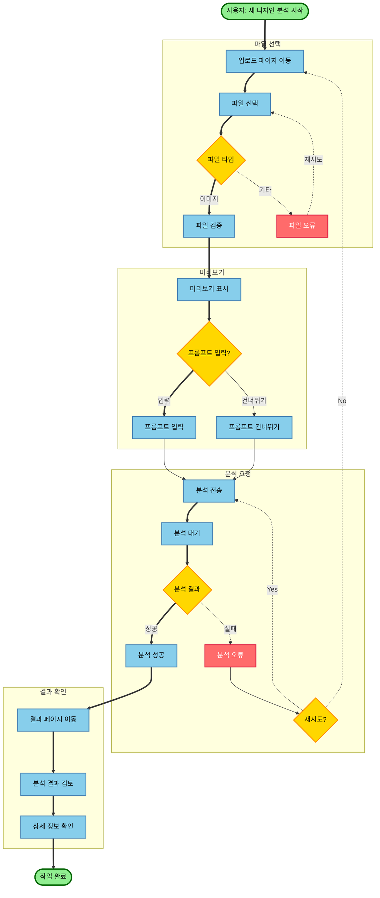
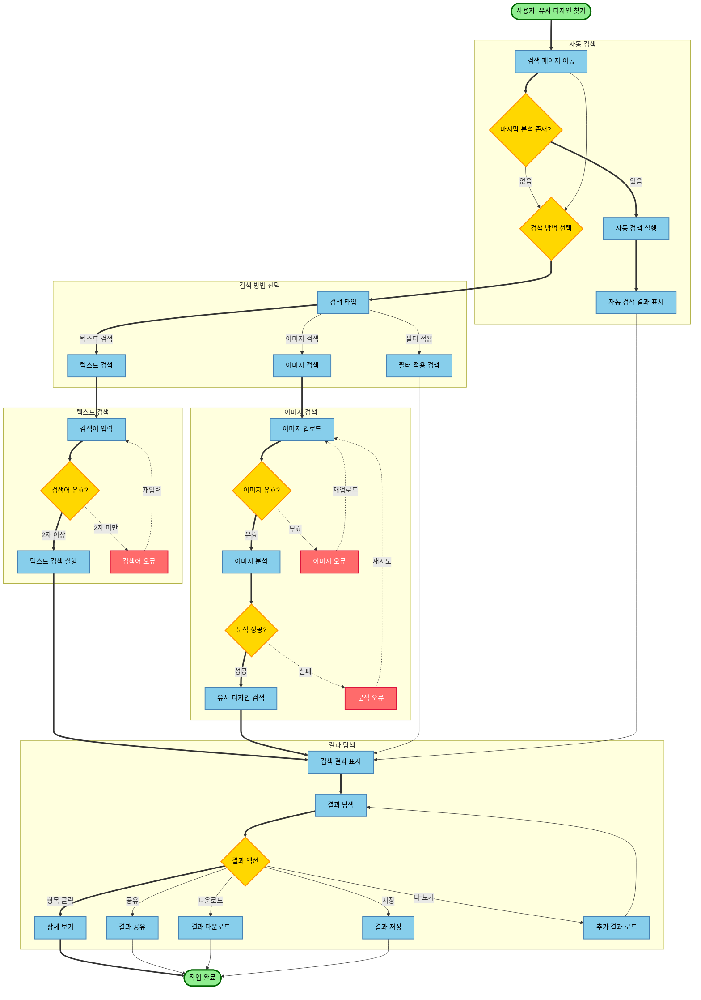
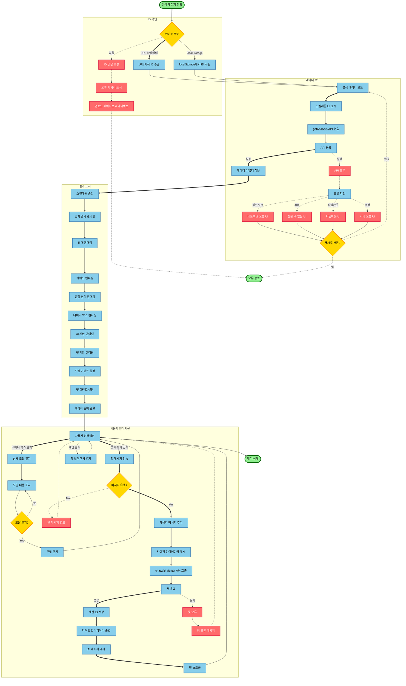

# dysapp 유저 플로우차트

**작성일**: 2025-01-15  
**프로젝트**: dysapp1210  
**버전**: 1.0.0

---

## 목차

1. [전체 유저 여정](#1-전체-유저-여정)
2. [주요 유저 시나리오](#2-주요-유저-시나리오)
3. [페이지별 유저 플로우](#3-페이지별-유저-플로우)

---

## 1. 전체 유저 여정

### 1.1 첫 사용자 여정 (First-Time User Journey)

### 1.2 재방문 사용자 여정 (Returning User Journey)

---

## 2. 주요 유저 시나리오

### 2.1 시나리오 1: 새 디자인 분석하기

### 2.2 시나리오 2: 유사 디자인 찾기

### 2.3 시나리오 3: AI 멘토와 대화하기

```mermaid
flowchart TD
    Start([사용자: AI 멘토와 대화]):::startEnd
    GoAnalyze[분석 페이지 이동]:::process
    
    Start ==> GoAnalyze
    
    subgraph 분석_확인["분석 확인"]
        direction TB
        CheckAnalysis{"분석 데이터 존재?"}:::decision
        LoadAnalysis[분석 데이터 로드]:::process
        RenderAnalysis[분석 결과 렌더링]:::process
        NoAnalysisError[분석 없음 오류]:::error
        
        GoAnalyze ==> CheckAnalysis
        CheckAnalysis ==>|있음| LoadAnalysis
        CheckAnalysis -.->|없음| NoAnalysisError
        LoadAnalysis ==> RenderAnalysis
    end
    
    subgraph 챗_준비["챗 준비"]
        direction TB
        ShowChat[챗 인터페이스 표시]:::process
        CheckSession{"세션 존재?"}:::decision
        LoadHistory[대화 히스토리 로드]:::process
        NewSession[새 세션 시작]:::process
        DisplayHistory[히스토리 표시]:::process
        ReadyChat[챗 준비 완료]:::process
        
        RenderAnalysis ==> ShowChat
        ShowChat ==> CheckSession
        CheckSession ==>|있음| LoadHistory
        CheckSession -->|없음| NewSession
        LoadHistory ==> DisplayHistory
        NewSession --> ReadyChat
        DisplayHistory --> ReadyChat
    end
    
    subgraph 대화["대화 진행"]
        direction TB
        UserInput[사용자 입력]:::process
        InputType{"입력 타입"}:::decision
        TypeMessage[메시지 입력]:::process
        UseSuggestion[제안 사용]:::process
        FillInput[입력란 채우기]:::process
        SendMessage[메시지 전송]:::process
        ValidateInput{"입력 유효?"}:::decision
        EmptyWarning[빈 메시지 경고]:::error
        ShowTyping[타이핑 표시]:::process
        CallChatAPI[챗 API 호출]:::process
        ChatResponse[챗 응답]:::process
        HideTyping[타이핑 숨김]:::process
        DisplayResponse[AI 응답 표시]:::process
        ChatError[챗 오류]:::error
        ShowChatError[챗 오류 메시지]:::error
        RetryChat{"재시도?"}:::decision
        ContinueChat{"계속 대화?"}:::decision
        
        ReadyChat ==> UserInput
        UserInput ==> InputType
        InputType ==>|직접 입력| TypeMessage
        InputType -->|제안 클릭| UseSuggestion
        UseSuggestion --> FillInput
        FillInput --> TypeMessage
        TypeMessage ==> SendMessage
        SendMessage ==> ValidateInput
        ValidateInput ==>|유효| ShowTyping
        ValidateInput -.->|무효| EmptyWarning
        EmptyWarning -.-> UserInput
        ShowTyping ==> CallChatAPI
        CallChatAPI ==> ChatResponse
        ChatResponse ==>|성공| HideTyping
        ChatResponse -.->|실패| ChatError
        HideTyping ==> DisplayResponse
        ChatError -.-> ShowChatError
        ShowChatError --> RetryChat
        RetryChat -.->|Yes| SendMessage
        RetryChat -.->|No| ContinueChat
        DisplayResponse ==> ContinueChat
        ContinueChat ==>|Yes| UserInput
        ContinueChat -->|No| EndChat
    end
    
    EndChat([대화 종료]):::startEnd
    NoAnalysisError -.-> EndChat
    
    ContinueChat -->|No| EndChat
    
    classDef startEnd fill:#90EE90,stroke:#006400,stroke-width:3px,color:#000
    classDef process fill:#87CEEB,stroke:#4682B4,stroke-width:2px,color:#000
    classDef decision fill:#FFD700,stroke:#FF8C00,stroke-width:2px,color:#000
    classDef error fill:#FF6B6B,stroke:#DC143C,stroke-width:2px,color:#fff
```

---

## 3. 페이지별 유저 플로우

### 3.1 업로드 페이지 유저 플로우

```mermaid
flowchart TD
    Start([업로드 페이지 진입]):::startEnd
    InitUpload[업로드 페이지 초기화]:::process
    
    Start ==> InitUpload
    
    subgraph 파일_선택["파일 선택"]
        direction TB
        WaitInteraction[사용자 인터랙션 대기]:::process
        InteractionType{"인터랙션 타입"}:::decision
        OpenFileDialog[파일 선택 다이얼로그]:::process
        HandleDrop[드래그 앤 드롭 처리]:::process
        FileSelected{"파일 선택됨?"}:::decision
        
        InitUpload ==> WaitInteraction
        WaitInteraction ==> InteractionType
        InteractionType ==>|파일 클릭| OpenFileDialog
        InteractionType -->|드래그 앤 드롭| HandleDrop
        OpenFileDialog --> FileSelected
        HandleDrop --> FileSelected
    end
    
    subgraph 파일_검증["파일 검증"]
        direction TB
        ValidateFile[파일 검증]:::process
        FileError[파일 오류 토스트]:::error
        ReadFile[파일 읽기 Base64]:::process
        ShowPreview[미리보기 표시]:::process
        FileReady[파일 준비 완료]:::process
        
        FileSelected ==>|Yes| ValidateFile
        FileSelected -->|No| WaitInteraction
        ValidateFile ==>|유효| ReadFile
        ValidateFile -.->|무효| FileError
        FileError -.->|재시도| WaitInteraction
        ReadFile ==> ShowPreview
        ShowPreview ==> FileReady
    end
    
    subgraph 분석_시작["분석 시작"]
        direction TB
        UserAction{"사용자 액션"}:::decision
        StartAnalysis[분석 시작]:::process
        FillPrompt[프롬프트 자동 입력]:::process
        CheckFile{"파일 선택됨?"}:::decision
        WarnNoFile[파일 선택 필요 경고]:::error
        PrepareRequest[요청 데이터 준비]:::process
        GetPrompt{"프롬프트 입력?"}:::decision
        WithPrompt[프롬프트 포함]:::process
        NoPrompt[프롬프트 없음]:::process
        CallAPI[analyzeDesign API 호출]:::process
        
        FileReady ==> UserAction
        UserAction ==>|전송 버튼| StartAnalysis
        UserAction -->|Enter 키| StartAnalysis
        UserAction -->|추천 버튼| FillPrompt
        FillPrompt --> UserAction
        StartAnalysis ==> CheckFile
        CheckFile -.->|No| WarnNoFile
        WarnNoFile -.-> WaitInteraction
        CheckFile ==>|Yes| PrepareRequest
        PrepareRequest ==> GetPrompt
        GetPrompt ==>|있음| WithPrompt
        GetPrompt -->|없음| NoPrompt
        WithPrompt --> CallAPI
        NoPrompt --> CallAPI
    end
    
    subgraph API_응답["API 응답"]
        direction TB
        APIResult[API 응답]:::process
        StoreId[analysisId localStorage 저장]:::process
        APIError[API 오류 처리]:::error
        ShowAPIError[에러 메시지 표시]:::error
        Navigate[analyze로 이동]:::process
        
        CallAPI ==> APIResult
        APIResult ==>|성공| StoreId
        APIResult -.->|실패| APIError
        StoreId ==> Navigate
        APIError -.-> ShowAPIError
    end
    
    End([분석 페이지 표시]):::startEnd
    EndError([오류 종료]):::startEnd
    
    Navigate ==> End
    ShowAPIError -.-> EndError
    
    classDef startEnd fill:#90EE90,stroke:#006400,stroke-width:3px,color:#000
    classDef process fill:#87CEEB,stroke:#4682B4,stroke-width:2px,color:#000
    classDef decision fill:#FFD700,stroke:#FF8C00,stroke-width:2px,color:#000
    classDef error fill:#FF6B6B,stroke:#DC143C,stroke-width:2px,color:#fff
```

### 3.2 분석 페이지 유저 플로우

---

## 유저 플로우 요약

### 주요 진입점
1. **업로드 페이지** (`index.html`) - 새 디자인 분석 시작
2. **분석 페이지** (`analyze.html`) - 분석 결과 확인 및 AI 대화
3. **검색 페이지** (`searchTab.html`) - 유사 디자인 검색
4. **마이페이지** (`mypage.html`) - 프로필 및 히스토리 관리

### 주요 사용자 여정
1. **첫 사용자**: 인증 → 업로드 → 분석 → 결과 확인
2. **재방문 사용자**: 인증 → 메인 선택 → 원하는 기능 사용
3. **AI 멘토 대화**: 분석 페이지 → 챗 시작 → 대화 진행
4. **유사 디자인 검색**: 검색 페이지 → 검색 방법 선택 → 결과 탐색

### 주요 터치포인트
- 파일 업로드 (드래그 앤 드롭 또는 파일 선택)
- 분석 결과 시각화
- AI 멘토 챗 인터페이스
- 검색 결과 카드
- 히스토리 목록

---

**문서 끝**
